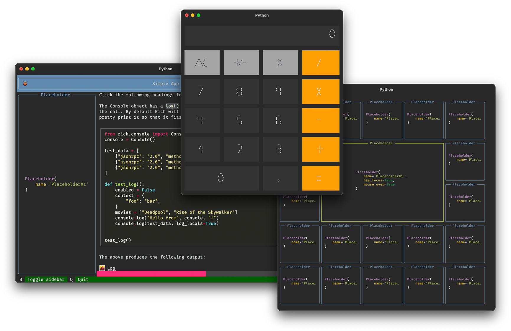

# Textual

Textual is a TUI (Text User Interface) framework for Python using [Rich](https://github.com/willmcgugan/rich) as a renderer.

The end goal is to be able to rapidly create *rich* terminal applications that look as good as possible (within the restrictions imposed by a terminal emulator).

Rich TUI will integrate tightly with its parent project, Rich. Any of the existing *renderables* can be used in a more dynamic application.

This project is currently a work in progress and may not be usable for a while. Follow [@willmcgugan](https://twitter.com/willmcgugan) for progress updates, or post in Discussions if you have any requests / suggestions. 

