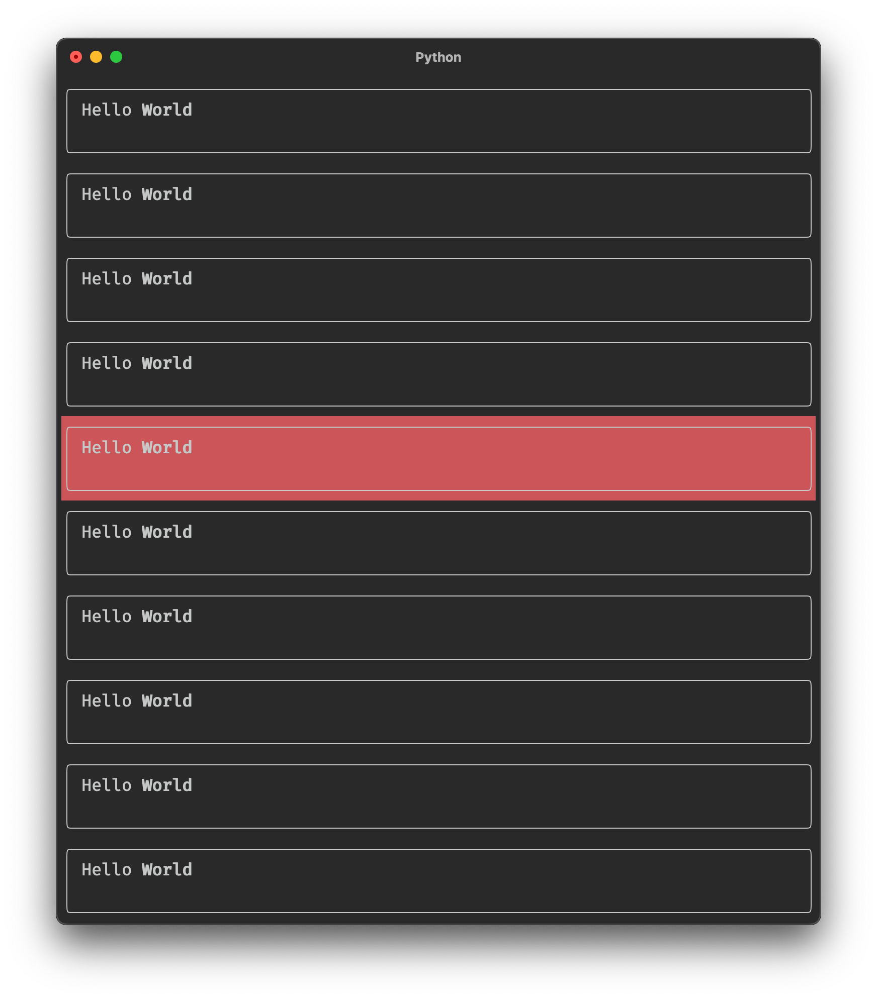

# Textual


Textual is a TUI (Text User Interface) framework for Python using [Rich](https://github.com/willmcgugan/rich) as a renderer and inspired by modern web development. Currently a work in progress, but usable by brave souls who don't mind some API instability between updates.

The end goal is to be able to rapidly create _rich_ terminal applications that look as good as possible (within the restrictions imposed by a terminal emulator).

Textual will be eventually be cross platform, but for now it is MacOS / Linux only. Windows support is in the pipeline.

Follow [@willmcgugan](https://twitter.com/willmcgugan) for progress updates, or post in Discussions if you have any requests / suggestions.

## How it works

Textual has far more in common with web development than with curses. Every component has at its core a _message pump_ which can receive and process events, a system modelled after JS in the browser. Web developers will recognize timers, intervals, event propagation etc.

Textual borrows other technologies from the web development world; layout is done with CSS grid and (soon) the theme may be customized with CSS. Textual is also influenced by modern JS frameworks such as Vue and React where modifying the state will automatically update the display.

## Installation

You can install Textual via pip (`pip install textual`), or by checking out the repo and installing with [poetry](https://python-poetry.org/docs/).

```
poetry install
```

## Examples

Until I've written the documentation, the examples are the best way to learn Textual. Run any of the Python files in [examples](https://github.com/willmcgugan/textual/tree/main/examples) and read the code to see how it works.

## Building Textual applications

_This guide is a work in progress_

Let's look at the simplest Textual app which does _something_:

```python
from textual.app import App


class Beeper(App):
    async def on_key(self, event):
        self.console.bell()


Beeper.run()
```

Here we can see a textual app with a single `on_key` method which will receive key events. Any key event will result in playing a beep noise. Hit ctrl+C to exit.

Event handlers in Textual are defined by convention, not by inheritance (so you won't find an `on_key` method in the base class). Each event has a `name` attribute which for the key event is simply `"key"`. Textual will call the method named `on_<event.name>` if it exists.

Lets look at a _slightly_ more interesting example:

```python
from textual.app import App


class ColorChanger(App):
    async def on_key(self, event):
        if event.key.isdigit():
            self.background = f"on color({event.key})"


ColorChanger.run(log="textual.log")
```

This example also handles key events, and will set `App.background` if the key is a digit. So pressing the keys 0 to 9 will change the background color to the corresponding [ansi color](https://rich.readthedocs.io/en/latest/appendix/colors.html).

Note that we didn't need to explicitly refresh the screen or draw anything. Setting the `background` attribute is enough for Textual to update the visuals. This is an example of _reactivity_ in Textual. To make changes to the terminal interface you modify the _state_ and let Textual update the visuals.

## Widgets

To make more interesting apps you will need to make use of _widgets_, which are independent user interface elements. Textual comes with a (growing) library of widgets, but you can also develop your own.

Let's look at an app which contains widgets. We will be using the built in `Placeholder` widget which you can use to design application layouts before you implement the real content. They are very useful for testing.

```python
from textual import events
from textual.app import App
from textual.widgets import Placeholder


class SimpleApp(App):

    async def on_mount(self, event: events.Mount) -> None:
        await self.view.dock(Placeholder(), edge="left", size=40)
        await self.view.dock(Placeholder(), Placeholder(), edge="top")


SimpleApp.run(log="textual.log")
```

This app contains a single event handler `on_mount`. The mount event is sent when the app or widget is ready to start processing events. We can use it for initializing things. In this case we are going to call `self.view.dock` to add widgets to the interface. More about the `view` object later.

Here's the first line in the mount handler:

```python
await self.view.dock(Placeholder(), edge="left", size=40)
```

Note this method is asynchronous like almost all API methods in Textual. We are awaiting `self.view.dock` which takes a newly constructed Placeholder widget, and docks it on to the `"left"` edge of the terminal with a size of 40 characters. In a real app you might use this to display a side-bar.

The following line is similar:

```python
await self.view.dock(Placeholder(), Placeholder(), edge="top")
```

You will notice that this time we are docking _two_ Placeholder objects on _the_ top edge. We haven't set an explicit size this time so Textual will divide the remaining size amongst the two new widgets.

The last line calls the `run` class method in the usual way, but with an argument we haven't seen before: `log="textual.log"` tells Textual to write log information to the given file. You can tail textual.log to see the events being processed and other debug information.

If you run the above example, you will see something like the following:


If you move the mouse over the terminal you will notice that widgets receive mouse events. You can click any of the placeholders to give it input focus.

The dock layout feature is good enough for most purposes. For more sophisticated layouts we can use the grid API. See the [calculator.py](https://github.com/willmcgugan/textual/blob/main/examples/calculator.py) example which makes use of Grid.

### Creating Widgets

You can create your own widgets by subclassing the `textual.widget.Widget` class and implementing a `render()` method which should return anything that can be rendered with [Rich](https://rich.readthedocs.io/en/latest/introduction.html), including a plain string which will be interpreted as [console markup](https://rich.readthedocs.io/en/latest/markup.html).

Lets look at an example with a custom widget:

```python
from rich.panel import Panel

from textual import events
from textual.app import App
from textual.reactive import Reactive
from textual.widget import Widget


class Hover(Widget):

    mouse_over: Reactive[bool] = Reactive(False)

    def render(self) -> Panel:
        return Panel("Hello [b]World[/b]", style=("on red" if self.mouse_over else ""))

    async def on_enter(self, event: events.Enter) -> None:
        self.mouse_over = True

    async def on_leave(self, event: events.Leave) -> None:
        self.mouse_over = False


class HoverApp(App):
    """Hover widget demonstration."""

    async def on_mount(self, event: events.Mount) -> None:
        hovers = (Hover() for _ in range(10))
        await self.view.dock(*hovers, edge="top")


HoverApp.run(log="textual.log")
```

The `Hover` class is a custom widget which displays a panel containing the classic text "Hello World". The first lin ein the Hover class may seem a little mysterious at this point:

```python
mouse_over: Reactive[bool] = Reactive(False)
```

This adds an `mouse_over` attribute to your class which is a bool which defaults to `False`. The typing part (`Reactive[bool]`) is not required, but will help you find bugs if you are using a tool like [Mypy](https://mypy.readthedocs.io/en/stable/). If you modify `self.mouse_over` Textual will update the Widget render automatically.

The following `render()` method is where you set how the widget should be displayed. In the Hover widget we return a Panel containing rich text with a background that changes depending on the value of `mouse_over`. The goal here is to add a mouseover effect to the widget, which we can achieve by handling two events: `Enter` and `Leave` which are sent when the mouse enters the widget and leaves it. Here are the two event handlers again:

```python
    async def on_enter(self, event: events.Enter) -> None:
        self.mouse_over = True

    async def on_leave(self, event: events.Leave) -> None:
        self.mouse_over = False
```

The app class has a `Mount` handler where we _dock_ 10 of these custom widgets from the top edge. If you run this script you will see something like the following:



If you move your mouse over the terminal you should see that the widget under the mouse cursor changes to a red background.

### Actions

_TODO_

### Events

_TODO_

### Timers and Intervals

_TODO_

## Developer VLog

Since Textual is a visual medium, I'll be documenting new features and milestones here.

### Update 1 - Basic scrolling

[](http://www.youtube.com/watch?v=zNW7U36GHlU)

### Update 2 - Keyboard toggle

[](http://www.youtube.com/watch?v=bTYeFOVNXDI)

### Update 3 - New scrollbars, and smooth scrolling

[](http://www.youtube.com/watch?v=4LVl3ClrXIs)

### Update 4 - Animation system with easing function

Now with a system to animate a value to another value. Here applied to the scroll position. The animation system supports CSS like _easing functions_. You may be able to tell from the video that the page up / down keys cause the window to first speed up and then slow down.

[](http://www.youtube.com/watch?v=k2VwOp1YbSk)

### Update 5 - New Layout system

A new update system allows for overlapping layers. Animation is now synchronized with the display which makes it very smooth!

[](http://www.youtube.com/watch?v=XxRnfx2WYRw)

### Update 6 - New Layout API

New version (0.1.4) with API updates and the new layout system.

[](http://www.youtube.com/watch?v=jddccDuVd3E)

### Update 7 - New Grid Layout

**11 July 2021**

Added a new layout system modelled on CSS grid. The example demonstrates how once created a grid will adapt to the available space.

[](http://www.youtube.com/watch?v=Zh9CEvu73jc)

## Update 8 - Tree control and scroll views

**6 Aug 2021**

Added a tree control and refactored the renderer to allow for widgets within a scrollable veiew

[](http://www.youtube.com/watch?v=J-dzzD6NQJ4)
