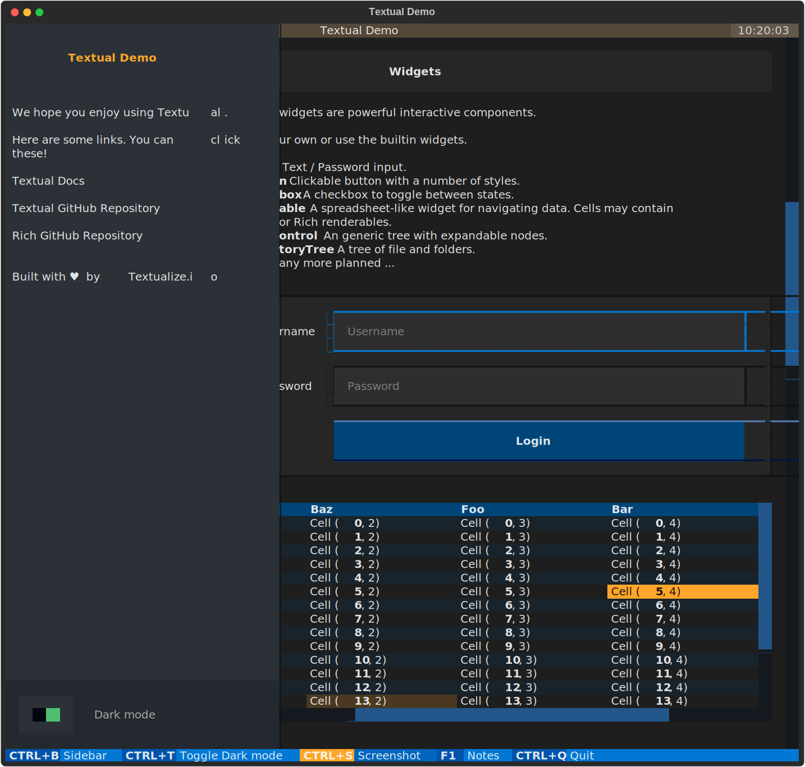

# Textual


Textual is a Python framework for creating interactive applications that run in your terminal.


## About

Textual adds interactivity to [Rich](https://github.com/Textualize/rich) with a Python API inspired by modern web development.

On modern terminal software (installed by default on most systems), Textual apps can use **16.7 million** colors with mouse support and smooth flicker-free animation. A powerful layout engine and re-usable components makes it possible to build apps that rival the desktop and web experience. 

## Compatibility

Textual runs on Linux, macOS, and Windows. Textual requires Python 3.7 or above.

## Installing

Install Textual via pip:

```
pip install textual[dev]
```

The addition of `[dev]` installs Textual development tools. See the [docs](https://textual.textualize.io/getting_started/) if you need help getting started.

## Demo

Run the following command to see a little of what Textual can do:

```
python -m textual
```



## Documentation

Head over to the [Textual documentation](http://textual.textualize.io/) to start building!

## Examples

The Textual repository comes with a number of examples you can experiment with or use as a template for your own projects.


<details>
  <summary> 🎬 Code browser </summary>
  <hr>

  This is the [code_browser.py](./examples/code_browser.py) example which clocks in at 61 lines (*including* docstrings and blank lines).

https://user-images.githubusercontent.com/554369/197188237-88d3f7e4-4e5f-40b5-b996-c47b19ee2f49.mov

 </details>


<details>  
  <summary> 📷 Calculator </summary>
  <hr>
  
This is [calculator.py](./examples/calculator.py) which demonstrates Textual grid layouts.
  

</details>


<details>
  <summary> 📷 Stopwatch </summary>
  <hr>

  This is the Stopwatch example from the tutorial.
  
### Light theme 
  


### Dark theme
  


</details>


## Reference commands

The `textual` command has a few sub-commands to preview Textual styles.

<details>  
  <summary> 🎬 Easing reference </summary>
  <hr>
  
This is the *easing* reference which demonstrates the easing parameter on animation, with both movement and opacity. You can run it with the following command:
  
```bash
textual easing
```


https://user-images.githubusercontent.com/554369/196157100-352852a6-2b09-4dc8-a888-55b53570aff9.mov


 </details>

<details>  
  <summary> 🎬 Borders reference </summary>
  <hr>
  
This is the borders reference which demonstrates some of the borders styles in Textual. You can run it with the following command:
  
```bash
textual borders
```


https://user-images.githubusercontent.com/554369/196158235-4b45fb78-053d-4fd5-b285-e09b4f1c67a8.mov


  
</details>
