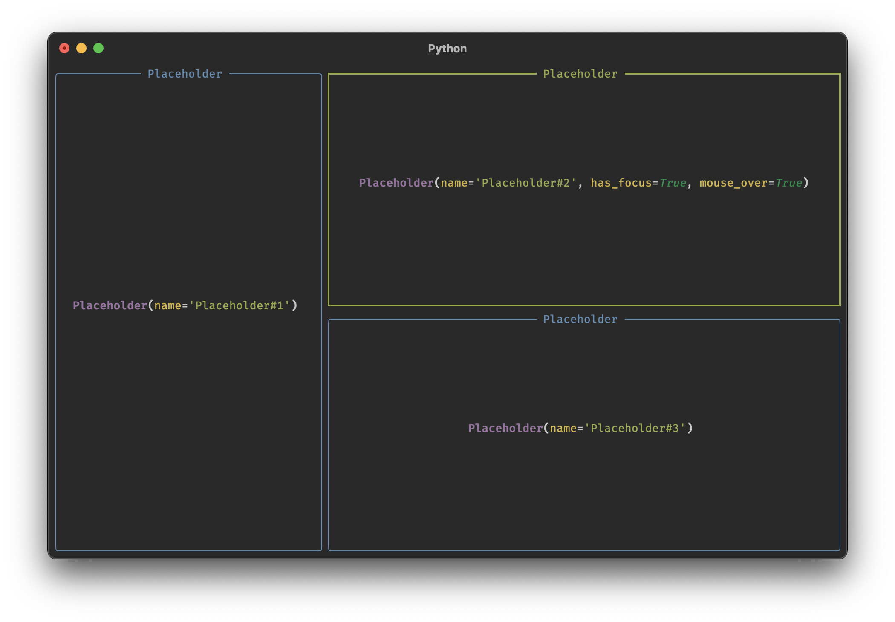
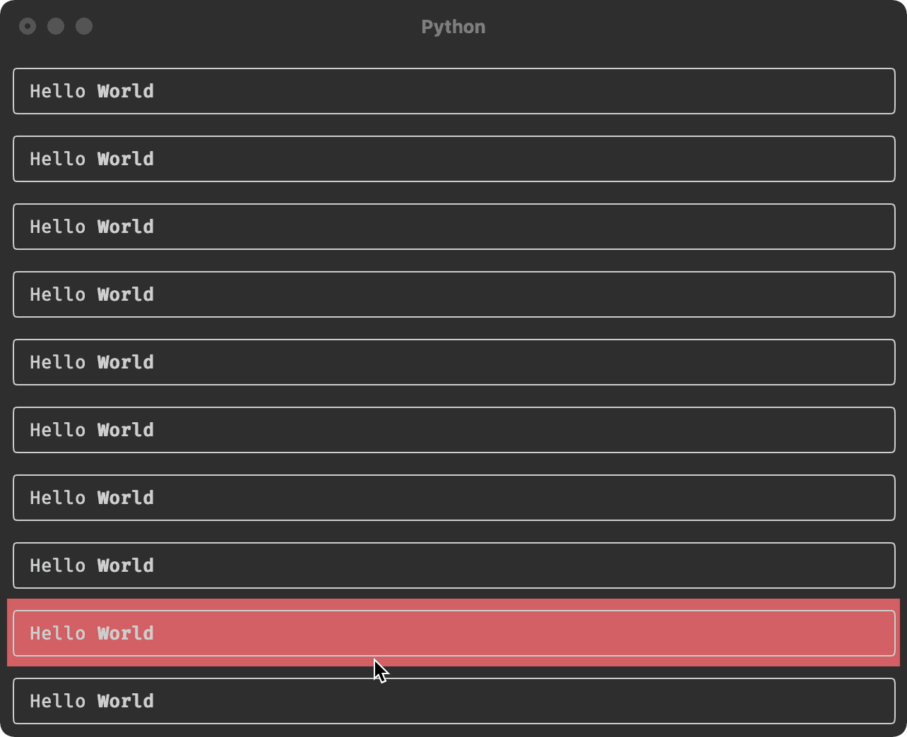

# Textual


Textual is a TUI (Text User Interface) framework for Python inspired by modern web development. Currently a work in progress, but usable by brave souls who don't mind some API instability between updates.

Textual currently runs on MacOS / Linux only. Windows support is in the pipeline.

Follow [@willmcgugan](https://twitter.com/willmcgugan) for progress updates, or post in Discussions if you have any requests / suggestions.

## How it works

Textual uses [Rich](https://github.com/willmcgugan/rich) to render rich text, so anything that Rich can render may be used in Textual.

Event handling in Textual is asynchronous (using `async` and `await` keywords). Widgets (UI components) can independently update and communicate with each other via message passing.

Textual has more in common with modern web development than it does with [curses](<https://en.wikipedia.org/wiki/Curses_(programming_library)>); layout is done with CSS grid and (soon) the theme may be customized with CSS. Other techniques are borrowed from JS frameworks such as Vue and Reactive.

## Installation

You can install Textual via pip (`pip install textual`), or by checking out the repo and installing with [poetry](https://python-poetry.org/docs/).

```
poetry install
```

Once installed you can run the following command for a quick test, or see examples (below):

```
python -m textual.app
```

Textual requires Python 3.7 or above.

## Examples

Until I've written the documentation, the [examples](https://github.com/willmcgugan/textual/tree/main/examples/) may be the best way to learn Textual.

You can see some of these examples in action in the [Developer Video Log](#developer-video-log).

- [animation.py](https://github.com/willmcgugan/textual/tree/main/examples/animation.py) Demonstration of 60fps animation easing function
- [calculator.py](https://github.com/willmcgugan/textual/tree/main/examples/calculator.py) A "clone" of the MacOS calculator using Grid layout
- [code_viewer.py](https://github.com/willmcgugan/textual/tree/main/examples/code_viewer.py) A demonstration of a tree view which loads syntax highlighted code
- [grid.py](https://github.com/willmcgugan/textual/tree/main/examples/calculator.py) A simple demonstration of adding widgets in a Grid layout
- [grid_auto.py](https://github.com/willmcgugan/textual/tree/main/examples/grid_auto.py) A demonstration of automatic Grid layout
- [simple.py](https://github.com/willmcgugan/textual/tree/main/examples/simple.py) A very simple Textual app with scrolling Markdown view

## Building Textual applications

_This guide is a work in progress_

Let's look at the simplest Textual app which does _something_:

```python
from textual.app import App


class Beeper(App):
    def on_key(self):
        self.console.bell()


Beeper.run()
```

Here we can see a textual app with a single `on_key` method which will handle key events. Pressing any key will result in playing the terminal bell (generally an irritating beep). Hit Ctrl+C to exit.

Event handlers in Textual are defined by convention, not by inheritance (so you won't find an `on_key` method in the base class). Each event has a `name` attribute which for the key event is simply `"key"`. Textual will call the method named `on_<event.name>` if it exists.

Let's look at a _slightly_ more interesting example:

```python
from textual.app import App


class ColorChanger(App):
    def on_key(self, event):
        if event.key.isdigit():
            self.background = f"on color({event.key})"


ColorChanger.run(log="textual.log")
```

You'll notice that the `on_key` method above contains an additional `event` parameter which wasn't present on the beeper example. If the `event` argument is present, Textual will call the handler with an event object. Every event has an associated handler object, in this case it is a KeyEvent which contains additional information regarding which key was pressed.

The key event handler above will set the background attribute if you press the keys 0-9, which turns the terminal to the corresponding [ansi color](https://rich.readthedocs.io/en/latest/appendix/colors.html).

Note that we didn't need to explicitly refresh the screen or draw anything. Setting the `background` attribute to a [Rich style](https://rich.readthedocs.io/en/latest/style.html) is enough for Textual to update the visuals. This is an example of _reactivity_ in Textual. To make changes to the terminal interface you modify the _state_ and let Textual update the UI.

## Widgets

To make more interesting apps you will need to make use of _widgets_, which are independent user interface elements. Textual comes with a (growing) library of widgets, but you can develop your own.

Let's look at an app which contains widgets. We will be using the built-in `Placeholder` widget which you can use to design application layouts before you implement the real content.

```python
from textual.app import App
from textual.widgets import Placeholder


class SimpleApp(App):

    async def on_mount(self) -> None:
        await self.view.dock(Placeholder(), edge="left", size=40)
        await self.view.dock(Placeholder(), Placeholder(), edge="top")


SimpleApp.run(log="textual.log")
```

This app contains a single event handler `on_mount`. The mount event is sent when the app or widget is ready to start processing events, and is typically used for initialization. You may have noticed that `on_mount` is an `async` function. Since Textual is an asynchronous framework we will need this if we need to call most other methods.

The `on_mount` method makes two calls to `self.view.dock` which adds widgets to tht terminal.

Here's the first line in the mount handler:

```python
await self.view.dock(Placeholder(), edge="left", size=40)
```

Note this method is asynchronous like almost all API methods in Textual. We are awaiting `self.view.dock` which takes a newly constructed Placeholder widget, and docks it on to the `"left"` edge of the terminal with a size of 40 characters. In a real app you might use this to display a side-bar.

The following line is similar:

```python
await self.view.dock(Placeholder(), Placeholder(), edge="top")
```

You will notice that this time we are docking _two_ Placeholder objects onto the `"top"` edge. We haven't set an explicit size this time so Textual will divide the remaining size amongst the two new widgets.

The last line calls the `run` class method in the usual way, but with an argument we haven't seen before: `log="textual.log"` tells Textual to write log information to the given file. You can tail textual.log to see events being processed and other debug information.

If you run the above example, you will see something like the following:



If you move the mouse over the terminal you will notice that widgets receive mouse events. You can click any of the placeholders to give it input focus.

The dock layout feature is very flexible, but for more sophisticated layouts we can use the grid API. See the [calculator.py](https://github.com/willmcgugan/textual/blob/main/examples/calculator.py) example which makes use of Grid.

### Creating Widgets

You can create your own widgets by subclassing the `textual.widget.Widget` class and implementing a `render()` method which should return anything that can be rendered with [Rich](https://rich.readthedocs.io/en/latest/introduction.html), including a plain string which will be interpreted as [console markup](https://rich.readthedocs.io/en/latest/markup.html).

Let's look at an example with a custom widget:

```python
from rich.panel import Panel

from textual.app import App
from textual.reactive import Reactive
from textual.widget import Widget


class Hover(Widget):

    mouse_over = Reactive(False)

    def render(self) -> Panel:
        return Panel("Hello [b]World[/b]", style=("on red" if self.mouse_over else ""))

    def on_enter(self) -> None:
        self.mouse_over = True

    def on_leave(self) -> None:
        self.mouse_over = False


class HoverApp(App):
    """Demonstrates custom widgets"""

    async def on_mount(self) -> None:
        hovers = (Hover() for _ in range(10))
        await self.view.dock(*hovers, edge="top")


HoverApp.run(log="textual.log")
```

The `Hover` class is a custom widget which displays a panel containing the classic text "Hello World". The first line in the Hover class may seem a little mysterious at this point:

```python
mouse_over = Reactive(False)
```

This adds a `mouse_over` attribute to your class which is a bool with a default of `False`. Adding attributes like this makes them _reactive_: any changes will result in the widget updating.

The following `render()` method is where you define how the widget should be displayed. In the Hover widget we return a [Panel](https://rich.readthedocs.io/en/latest/panel.html) containing rich text with a background that changes depending on the value of `mouse_over`. The goal here is to add a mouse hover effect to the widget, which we can achieve by handling two events: `Enter` and `Leave`. These events are sent when the mouse enters or leaves the widget.

Here are the two event handlers again:

```python
    def on_enter(self) -> None:
        self.mouse_over = True

    def on_leave(self) -> None:
        self.mouse_over = False
```

Both event handlers set the `mouse_over` attribute which will result in the widget's `render()` method being called.

The `HoverApp` has a `on_mount` handler which creates 10 Hover widgets and docks them on the top edge to create a vertical stack:

```python
    async def on_mount(self) -> None:
        hovers = (Hover() for _ in range(10))
        await self.view.dock(*hovers, edge="top")
```

If you run this script you will see something like the following:



If you move your mouse over the terminal you should see that the widget under the mouse cursor changes to a red background.

### Actions and key bindings

Actions in Textual are white-listed functions that may be bound to keys. Let's look at a trivial example of binding a key to an action. Here is an app which exits when we hit the Q key:

```python
from textual.app import App


class Quitter(App):
    async def on_load(self, event):
        await self.bind("q", "quit")


Quitter.run()
```

If you run this you will get a blank terminal which will return to the prompt when you press Q.

Binding is done in the Load event handler. The `bind` method takes the key (in this case "q") and binds it to an action ("quit"). The quit action is built in to Textual and simply exits the app.

To define your own actions, add a method that begins with `action_`, which may take parameters. Let's create a simple action that changes the color of the terminal and binds keys to it:

```python
from textual.app import App


class Colorizer(App):

    async def on_load(self, event):
        await self.bind("r", "color('red')")
        await self.bind("g", "color('green')")
        await self.bind("b", "color('blue')")

    async def action_color(self, color:str) -> None:
        self.background = f"on {color}"


Colorizer.run()
```

If you run this app you can hit the keys R, G, or B to change the color of the background.

In the `on_load` method we have bound the keys R, G, and B to the `color` action with a single parameter. When you press any of these three keys Textual will call the method `action_color` with the appropriate parameter.

You could be forgiven for thinking that `"color('red')"` is Python code which Textual evaluates. This is not the case. The action strings are parsed and may not include expressions or arbitrary code. The reason that strings are used over a callable is that (in a future update) key bindings may be loaded from a configuration file.

### More on Events

_TODO_

### Watchers

_TODO_

### Animation

_TODO_

### Timers and Intervals

Textual has a `set_timer` and a `set_interval` method which work much like their Javascript counterparts. The `set_timer` method will invoke a callable after a given period of time, and `set_interval` will invoke a callable repeatedly. Unlike Javascript these methods expect the time to be in seconds (_not_ milliseconds).

Let's create a simple terminal based clock with the `set_interval` method:

```python
from datetime import datetime

from rich.align import Align

from textual.app import App
from textual.widget import Widget


class Clock(Widget):
    def on_mount(self):
        self.set_interval(1, self.refresh)

    def render(self):
        time = datetime.now().strftime("%c")
        return Align.center(time, vertical="middle")


class ClockApp(App):
    async def on_mount(self):
        await self.view.dock(Clock())


ClockApp.run()

```

If you run this app you will see the current time in the center of the terminal until you hit Ctrl+C.

The Clock widget displays the time using [rich.align.Align](https://rich.readthedocs.io/en/latest/reference/align.html) to position it in the center. In the clock's Mount handler there is the following call to `set_interval`:

```python
self.set_interval(1, self.refresh)
```

This tells Textual to call a function (in this case `self.refresh` which updates the widget) once a second. When a widget is refreshed it calls `Clock.render` again to display the latest time.

## Developer Video Log

Since Textual is a visual medium, I'll be documenting new features and milestones here.

### Update 1 - Basic scrolling

[](http://www.youtube.com/watch?v=zNW7U36GHlU)

### Update 2 - Keyboard toggle

[](http://www.youtube.com/watch?v=bTYeFOVNXDI)

### Update 3 - New scrollbars and smooth scrolling

[](http://www.youtube.com/watch?v=4LVl3ClrXIs)

### Update 4 - Animation system with easing function

Now with a system to animate changes to values, going from the initial to the final value in small increments over time . Here applied to the scroll position. The animation system supports CSS like _easing functions_. You may be able to tell from the video that the page up / down keys cause the window to first speed up and then slow down.

[](http://www.youtube.com/watch?v=k2VwOp1YbSk)

### Update 5 - New Layout system

A new update system allows for overlapping layers. Animation is now synchronized with the display which makes it very smooth!

[](http://www.youtube.com/watch?v=XxRnfx2WYRw)

### Update 6 - New Layout API

New version (0.1.4) with API updates and the new layout system.

[](http://www.youtube.com/watch?v=jddccDuVd3E)

### Update 7 - New Grid Layout

**11 July 2021**

Added a new layout system modelled on CSS grid. The example demonstrates how once created a grid will adapt to the available space.

[](http://www.youtube.com/watch?v=Zh9CEvu73jc)

## Update 8 - Tree control and scroll views

**6 Aug 2021**

Added a tree control and refactored the renderer to allow for widgets within a scrollable view

[](http://www.youtube.com/watch?v=J-dzzD6NQJ4)
