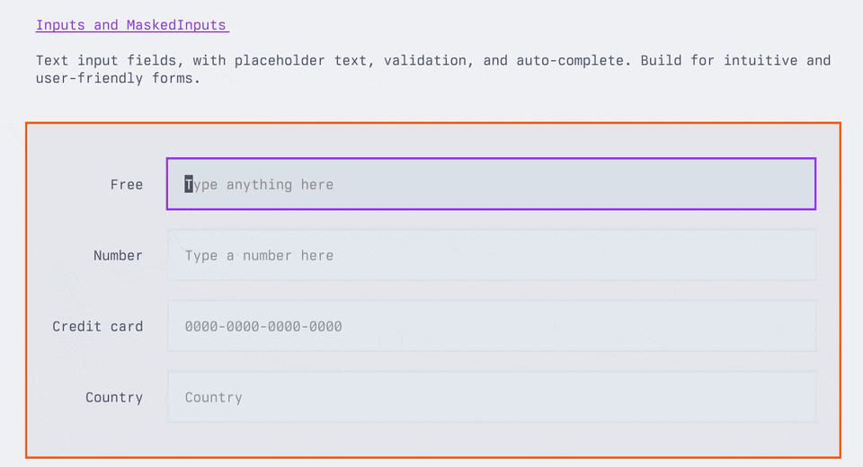
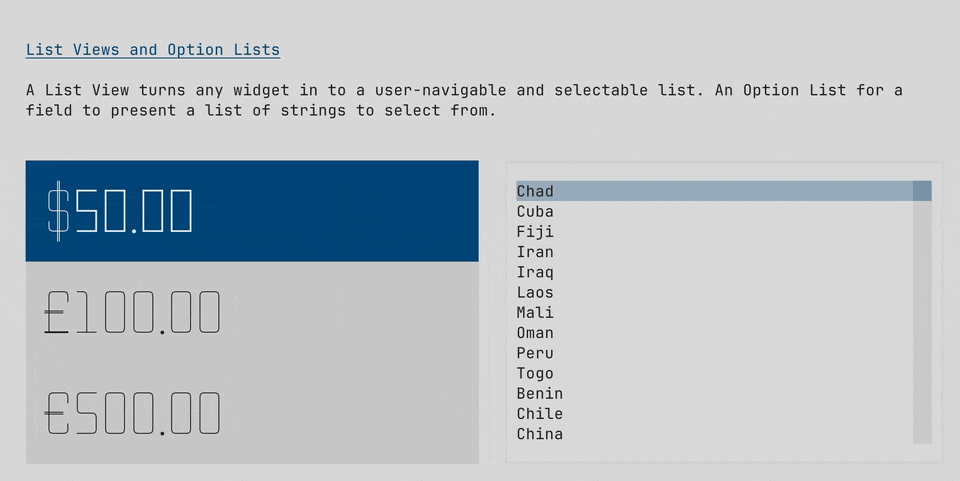
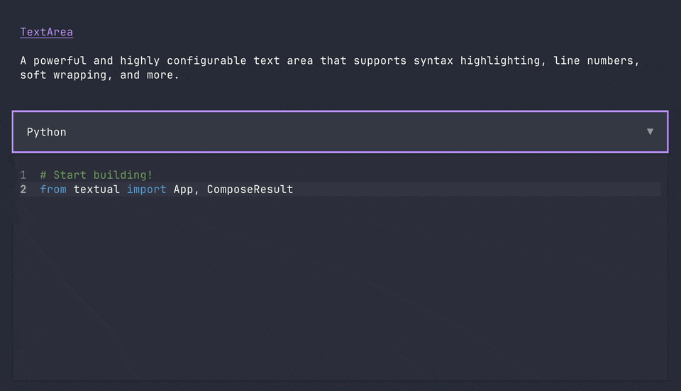

[](https://discord.gg/Enf6Z3qhVr)
[](https://pypi.org/project/textual/)
[](https://badge.fury.io/py/textual)


# Textual

Build cross-platform user interfaces with a simple Python API. Textual combines modern Python features with web development best practices, delivering an efficient cross-platform application development experience.

## Key Features
- 🖥️ Dual Rendering Engine - Write once, deploy to both terminal and web browsers  
- 🧩 50+ Built-in Widgets - Buttons, tables, tree views and more out-of-the-box  
- 🎨 Theme System - Multiple built-in UI themes with custom styling support  
- 🛠️ Developer Tools - Real-time terminal app debugging  
- ⚡ Async Core - Native async/await support  

Want some more examples? See the [examples](https://github.com/Textualize/textual/tree/main/examples) directory.

## Installing

### Prerequisites:
- Python 3.10+
- Terminal requirements: TrueColor-supported terminal (e.g. Windows Terminal, iTerm2)

Install Textual via pip:

```
pip install textual textual-dev
```
For development tools:

```
pip install "textual[dev]"
```


## Quick Start

```python
"""
An App to show the current time.
"""

from datetime import datetime

from textual.app import App, ComposeResult
from textual.widgets import Digits


class ClockApp(App):
    CSS = """
    Screen { align: center middle; }
    Digits { width: auto; }
    """

    def compose(self) -> ComposeResult:
        yield Digits("")

    def on_ready(self) -> None:
        self.update_clock()
        self.set_interval(1, self.update_clock)

    def update_clock(self) -> None:
        clock = datetime.now().time()
        self.query_one(Digits).update(f"{clock:%T}")


if __name__ == "__main__":
    app = ClockApp()
    app.run()
```


> [!TIP]
> Textual is an asynchronous framework under the hood. Which means you can integrate your apps with async libraries &mdash; if you want to.
> If you don't want or need to use async, Textual won't force it on you. 


## Widgets

Textual's library of [widgets](https://textual.textualize.io/widget_gallery/) covers everything from buttons, tree controls, data tables, inputs, text areas, and more…
Combined with a flexible [layout](https://textual.textualize.io/how-to/design-a-layout/) system, you can realize any User Interface you need.

Predefined themes ensure your apps will look good out of the box. 


<table>

<tr>

  <td>
    
  
    
  </td>

  <td>
    

    
  </td>
  
</tr>


<tr>

  <td>
    
  
    
  </td>

  <td>
    

    
  </td>
  
</tr>
<tr>

<td>



</td>

<td>


  
</td>

  
</tr>

</table>


## Demo


Run the following command to see a little of what Textual can do:

```
python -m textual
```

Or try the [textual demo](https://github.com/textualize/textual-demo) *without* installing (requires [uv](https://docs.astral.sh/uv/)):

```bash
uvx --python 3.12 textual-demo
```

## Dev Console


How do you debug an app in the terminal that is also running in the terminal?

The `textual-dev` package supplies a dev console that connects to your application from another terminal.
In addition to system messages and events, your logged messages and print statements will appear in the dev console.

See [the guide](https://textual.textualize.io/guide/devtools/) for other helpful tools provided by the `textual-dev` package.


## Command Palette


Textual apps have a *fuzzy search* command palette.
Hit `ctrl+p` to open the command palette.

It is easy to extend the command palette with [custom commands](https://textual.textualize.io/guide/command_palette/) for your application.


# Textual ❤️ Web


Textual apps are equally at home in the browser as they are the terminal. Any Textual app may be served with `textual serve` &mdash; so you can share your creations on the web.
Here's how to serve the demo app:

```
textual serve "python -m textual"
```

In addition to serving your apps locally, you can serve apps with [Textual Web](https://github.com/Textualize/textual-web).

Textual Web's firewall-busting technology can serve an unlimited number of applications.

Since Textual apps have low system requirements, you can install them anywhere Python also runs. Turning any device into a connected device.
No desktop required!


## Join us on Discord

Join the Textual developers and community on our [Discord Server](https://discord.gg/Enf6Z3qhVr).

