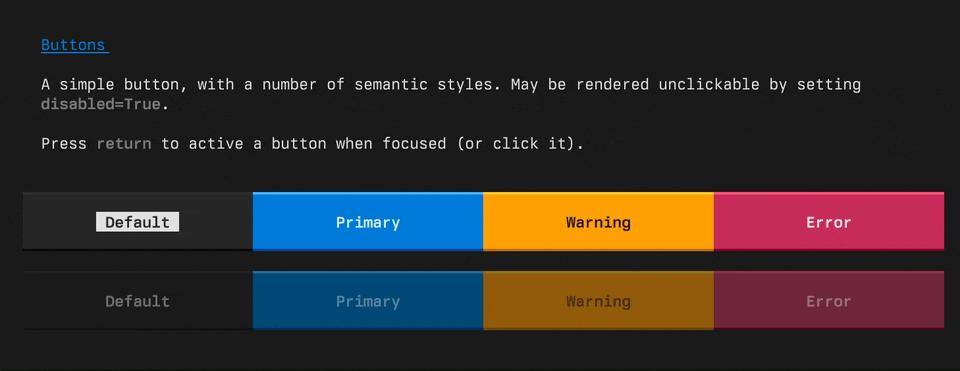
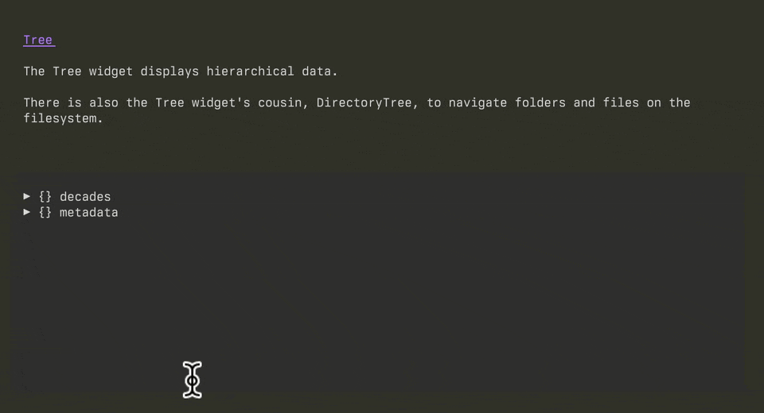
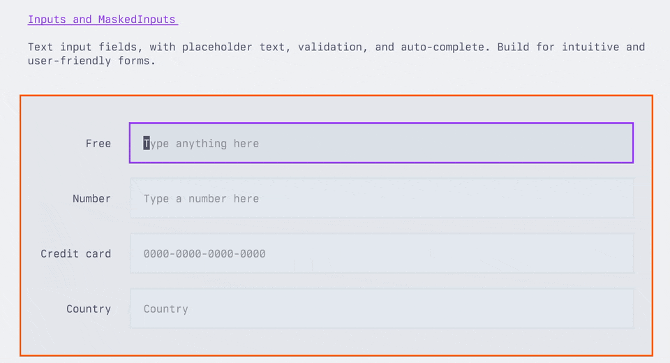
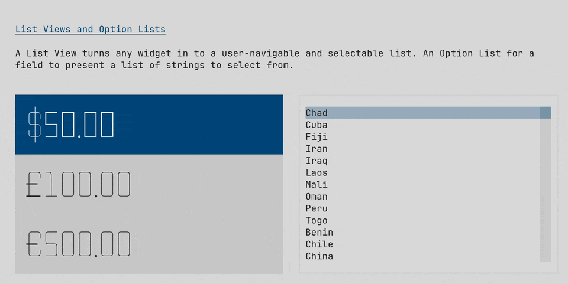
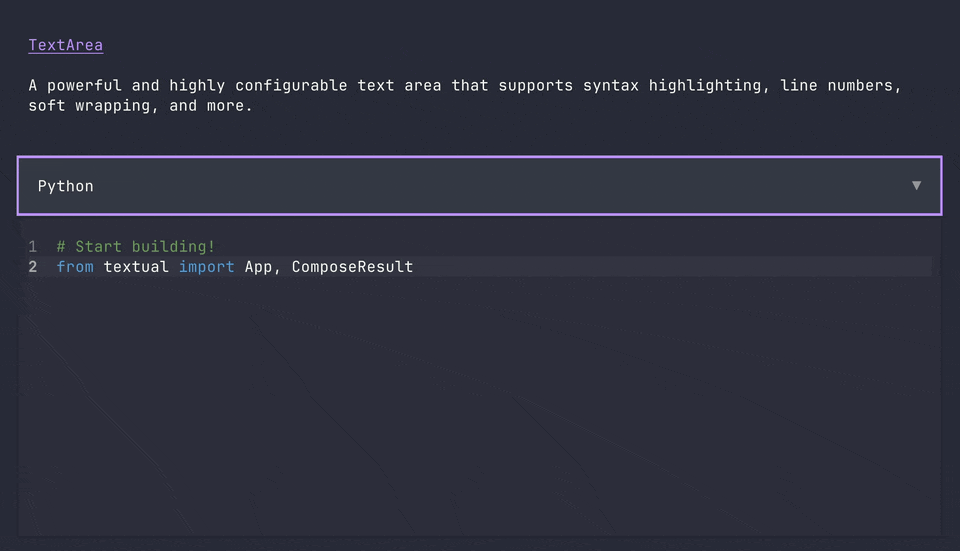

[](https://discord.gg/Enf6Z3qhVr)
[](https://pypi.org/project/textual/)
[](https://badge.fury.io/py/textual)


# Textual

使用简单的Python API构建终端和Web双平台用户界面。Textual结合了现代Python特性和Web开发的最佳实践，提供高效的跨平台应用开发体验。

## 项目特点
- 🖥️ 终端+浏览器双渲染引擎 - 一次开发，多端部署
- 🧩 50+内置组件 - 按钮/表格/树形控件等开箱即用
- 🎨 主题系统 - 内置多套UI主题，支持自定义样式
- 🛠️ 开发者工具 - 实时调试终端应用
- ⚡ 异步核心 - 原生支持async/await语法

需要更多示例？请查看[示例目录](https://github.com/Textualize/textual/tree/main/examples)。

## 安装指南

### 前置条件：
- Python 3.10+
- 终端要求：支持TrueColor的终端（如Windows Terminal/iTerm2）

通过pip安装Textual：

```
pip install textual
```

开发工具包：

```
pip install textual textual-dev
```

```python


## 快速入门

"""
显示当前时间的应用
"""

from datetime import datetime
from textual.app import App, ComposeResult
from textual.widgets import Digits


class ClockApp(App):
    CSS = """
    Screen { align: center middle; }
    Digits { width: auto; }
    """

    def compose(self) -> ComposeResult:
        yield Digits("")

    def on_ready(self) -> None:
        self.update_clock()
        self.set_interval(1, self.update_clock)

    def update_clock(self) -> None:
        clock = datetime.now().time()
        self.query_one(Digits).update(f"{clock:%T}")


if __name__ == "__main__":
    app = ClockApp()
    app.run()


>[!TIP]
>Textual底层是异步框架。这意味着您可以将应用与异步库集成——如果您需要的话。
>如果您不想或不需要使用异步，Textual不会强制您使用。


## 组件库

Textual的组件库包含按钮、树形控件、数据表格、输入框、文本区域等等...
结合灵活的布局系统，您可以实现任何需要的用户界面。

预定义的主题确保您的应用开箱即用，简便美观。


<table>

<tr>
 
  <td>
  
  
  
  </td>
  
  <td>
  


  </td>

</tr>


<tr>

  <td>!
  
  [数据表格](images/screenshot4.gif)
  
  </td>
  
  <td>
 

  
  </td>
  
</tr>
<tr>

<td>



</td>

<td>



</td>


</tr>

</table>


## 演示程序


运行以下命令查看Textual的部分功能：

```
python -m textual
```

或者尝试[textual演示](https://github.com/textualize/textual-demo)无需安装(需要uv)：

```bash
uvx --python 3.12 textual-demo
```

## 开发者控制台


如何调试一个也在终端中运行的终端应用？

textual-dev包提供了一个开发者控制台，可以从另一个终端连接到您的应用程序。
除了系统消息和事件外，您记录的日志消息和print语句也会显示在开发者控制台中。

请[参阅指南](https://textual.textualize.io/guide/devtools/)了解textual-dev包提供的其他有帮助的工具。


## 命令面板


Textual应用具有模糊搜索命令面板。
按`ctrl+p`打开命令面板。

您可以通过自定义命令轻松扩展命令面板。

[自定义命令](https://github.com/user-attachments/assets/94d8ec5d-b668-4033-a5cb-bf820e1b8d60)


## Textual ❤️ Web


Textual应用在浏览器中和终端中同样适用。任何Textual应用都可以用Web部署启动——这样您就可以在Web上分享您的创作。
以下是启动演示应用的方法：

```
Web部署 "python -m textual"
```

除了本地服务应用外，您还可以使用Textual Web服务应用。[Textual Web](https://github.com/Textualize/textual-web).

Textual Web的穿透防火墙技术可以服务无限数量的应用程序。

由于Textual应用的系统要求低，您可以在任何能运行Python的设备上安装它们。将任何设备变成联网设备。
这无需桌面环境！


## 加入我们的Discord

加入Textual开发者和社区，访问我们的Discord服务器。[Discord Server](https://discord.gg/Enf6Z3qhVr).
