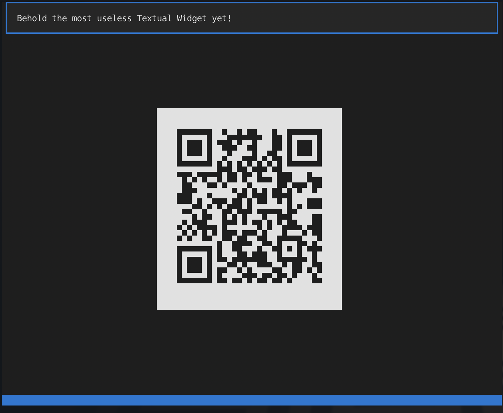

# Be the Keymaster!

## That didn't go to plan

So... yeah... the blog. When I wrote [my previous (and first)
post](https://textual.textualize.io/blog/2022/11/26/on-dog-food-the-original-metaverse-and-not-being-bored/)
I had wanted to try and do a post towards the end of each week, highlighting
what I'd done on the "dogfooding" front. Life kinda had other plans. Not in
a terrible way, but it turns out that getting both flu and Covid jabs (AKA
"jags" as they tend to say in my adopted home) on the same day doesn't
really agree with me too well.

I *have* been working, but there's been some odd moments in the past week
and a bit and, last week, once I got to the end, I was glad for it to end.
So no blog post happened.

Anyway...

<!-- more -->

## What have I been up to?

While mostly sat feeling sorry for myself on my sofa, I have been coding.
Rather than list all the different things here in detail, I'll quickly
mention them with links to where to find them and play with them if you
want:

### FivePyFive

While my Textual 5x5 puzzle is [one of the examples in the Textual
repo](https://github.com/Textualize/textual/tree/main/examples), I wanted to
make it more widely available so people can download it with `pip` or
[`pipx`](https://pypa.github.io/pipx/). See [over on
PyPi](https://pypi.org/project/fivepyfive/) and see if you can solve it. ;-)

<div class="video-wrapper">
    <iframe
        width="560" height="315"
        src="https://www.youtube.com/embed/Rf34Z5r7Q60"
        title="PISpy" frameborder="0"
        allow="accelerometer; autoplay; clipboard-write; encrypted-media; gyroscope; picture-in-picture"
        allowfullscreen>
    </iframe>
</div>

### textual-qrcode

I wanted to put together a very small example of how someone may put
together a third party widget library, and in doing so selected what I
thought was going to be a mostly-useless example: [a wrapper around a
text-based QR code generator
website](https://pypi.org/project/textual-qrcode/). Weirdly I've had a
couple of people express a need for QR codes in the terminal since
publishing that!



### PISpy

[PISpy](https://pypi.org/project/pispy-client/) is a very simple
terminal-based client for the [PyPi
API](https://warehouse.pypa.io/api-reference/). Mostly it provides a
hypertext interface to Python package details, letting you look up a package
and then follow its dependency links. It's *very* simple at the moment, but
I think more fun things can be done with this.

<div class="video-wrapper">
    <iframe
        width="560" height="315"
        src="https://www.youtube.com/embed/yMGD6bXqIEo"
        title="PISpy" frameborder="0"
        allow="accelerometer; autoplay; clipboard-write; encrypted-media; gyroscope; picture-in-picture"
        allowfullscreen>
    </iframe>
</div>

### OIDIA

I'm a big fan of the use of streak-tracking in one form or another.
Personally I use a [streak-tracking app](https://streaksapp.com/) for
keeping tabs of all sorts of good (and bad) habits, and as a heavy user of
all things Apple I make a lot of use of [the Fitness
rings](https://www.apple.com/uk/watch/close-your-rings/), etc. So I got to
thinking it might be fun to do a really simple, no shaming, no counting,
just recording, steak app for the Terminal.
[OIDIA](https://pypi.org/project/oidia/) is the result.

<div class="video-wrapper">
    <iframe
        width="560" height="315"
        src="https://www.youtube.com/embed/3Kz8eUzO9-8"
        title="YouTube video player"
        frameborder="0"
        allow="accelerometer; autoplay; clipboard-write; encrypted-media; gyroscope; picture-in-picture"
        allowfullscreen>
    </iframe>
</div>

As of the time of writing I only finished the first version of this
yesterday evening, so there are plenty of rough edges; but having got it to
a point where it performed the basic tasks I wanted from it, that seemed
like a good time to publish.

Expect to see this getting more updates and polish.

## Wait, what about this Keymaster thing?

Ahh, yes, about that... So one of the handy things I'm finding about Textual
is its [key binding
system](https://textual.textualize.io/guide/input/#bindings). The more
I build Textual apps, the more I appreciate the bindings, how they can be
associated with specific widgets, the use of actions (which can be used from
other places too), etc.

But... (there's always a "but" right -- I mean, there'd be no blog post to
be had here otherwise).

The terminal doesn't have access to all the key combinations you may want to
use, and also, because some keys can't necessarily be "typed", at least not
easily (think about it: there's no <kbd>F1</kbd> character, you have to type
`F1`), many keys and key combinations need to be bound with specific names.

So there's two problems here: how do I discover what keys even turn up in my
application, and when they do, what should I call them when I pass them to
[`Binding`](https://textual.textualize.io/api/binding/#textual.binding.Binding)?

That felt like a *"well Dave just build an app for it!"* problem. So I did:

<div class="video-wrapper">
    <iframe
        width="560" height="315"
        src="https://www.youtube.com/embed/-MV8LFfEOZo"
        title="YouTube video player"
        frameborder="0"
        allow="accelerometer; autoplay; clipboard-write; encrypted-media; gyroscope; picture-in-picture"
        allowfullscreen>
    </iframe>
</div>

If you're building apps with Textual and you want to discover what keys turn
up from your terminal and are available to your application, you can:

```sh
$ pipx install textual-keys
```

and then just run `textual-keys` and start mashing the keyboard to find out.

There's a good chance that this app, or at least a version of it, will make
it into Textual itself (very likely as one of the
[devtools](https://textual.textualize.io/guide/devtools/)). But for now it's
just an easy install away.

I think there's a call to be made here too: have you built anything to help
speed up how you work with Textual, or just make the development experience
"just so"? If so, do let us know, and come yell about it on the
[`#show-and-tell`
channel](https://discord.com/channels/1026214085173461072/1033752599112994867)
in [our Discord server](https://discord.gg/Enf6Z3qhVr).
