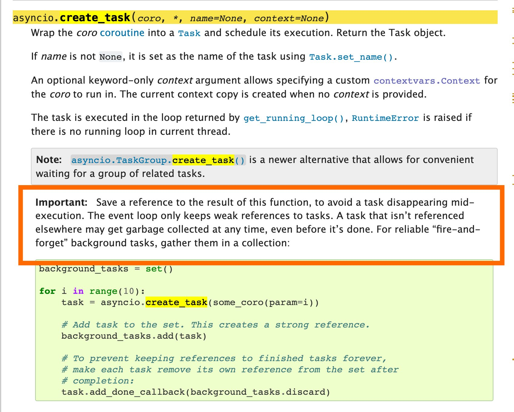

# The Heisenbug lurking in your async code

I'm taking a brief break from blogging about [Textual](https://github.com/Textualize/textual) to bring you this brief PSA for Python developers who work with async code. I wanted to expand a little on this [tweet](https://twitter.com/willmcgugan/status/1624419352211603461).

<!-- more -->

If you have ever used `asyncio.create_task` you may have created a bug for yourself that is challenging (read *almost impossible*) to reproduce. If it occurs, your code will likely fail in unpredictable ways.

The root cause of this [Heisenbug](https://en.wikipedia.org/wiki/Heisenbug) is that if you don't hold a reference to the task object returned by `create_task` then the task may disappear without warning when Python runs garbage collection. In other words, the code in your task will stop running with no obvious indication why.

This behavior is [well documented](https://docs.python.org/3/library/asyncio-task.html#asyncio.create_task), as you can see from this excerpt (emphasis mine):

But who reads all the docs? And who has perfect recall if they do? A search on GitHub indicates that there are a [lot of projects](https://github.com/search?q=%22asyncio.create_task%28%22&type=code) where this bug is waiting for just the right moment to ruin somebody's day.

I suspect the reason this mistake is so common is that tasks are a lot like threads (conceptually at least). With threads you can just launch them and forget. Unless you mark them as "daemon" threads they will exist for the lifetime of your app. Not so with Tasks.

The solution recommended in the docs is to keep a reference to the task for as long as you need it to live. On modern Python you could use [TaskGroups](https://docs.python.org/3/library/asyncio-task.html#task-groups) which will keep references to your tasks. As long as all the tasks you spin up are in TaskGroups, you should be fine.
