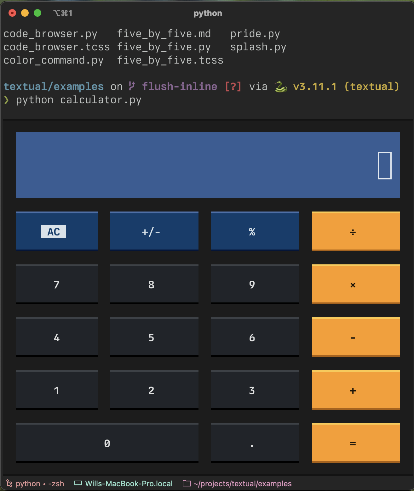

# Behind the Curtain of Inline Terminal Applications

Textual recently added the ability to run *inline* terminal apps.
You can see this in action if you run the [calculator example](https://github.com/Textualize/textual/blob/main/examples/calculator.py):



The application appears directly under the prompt, rather than occupying the full height of the screen&mdash;which is more typical of TUI applications.
You can interact with this calculator using keys *or* the mouse.
When you press ++ctrl+c++ the calculator disappears and returns you to the prompt.

Here's another app that creates an inline code editor:

=== "Video"

    <div class="video-wrapper">
        <iframe width="852" height="525" src="https://www.youtube.com/embed/Dt70oSID1DY" title="Inline app" frameborder="0" allow="accelerometer; autoplay; clipboard-write; encrypted-media; gyroscope; picture-in-picture; web-share" referrerpolicy="strict-origin-when-cross-origin" allowfullscreen></iframe>
    </div>


=== "inline.py"
    ```python 
    from textual.app import App, ComposeResult
    from textual.widgets import TextArea


    class InlineApp(App):
        CSS = """
        TextArea {
            height: auto;
            max-height: 50vh;
        }
        """

        def compose(self) -> ComposeResult:
            yield TextArea(language="python")


    if __name__ == "__main__":
        InlineApp().run(inline=True)

    ```

This post will cover some of what goes on under the hood to make such inline apps work.

It's not going to go in to too much detail.
I'm assuming most readers will be more interested in a birds-eye view rather than all the gory details.

<!-- more -->

## Programming the terminal

Firstly, let's recap how you program the terminal.
Broadly speaking, the terminal is a device for displaying text.
You write (or print) text to the terminal which typically appears at the end of a continually growing text buffer.
In addition to text you can also send [escape codes](https://en.wikipedia.org/wiki/ANSI_escape_code), which are short sequences of characters that instruct the terminal to do things such as change the text color, scroll, or other more exotic things.

We only need a few of these escape codes to implement inline apps.

!!! note

    I will gloss over the exact characters used for these escape codes.
    It's enough to know that they exist for now.
    If you implement any of this yourself, refer to the [wikipedia article](https://en.wikipedia.org/wiki/ANSI_escape_code). 

## Rendering frames

The first step is to display the app, which is simply text (possibly with escape sequences to change color and style).
The lines are terminated with a newline character (`"\n"`), *except* for the very last line (otherwise we get a blank line a the end which we don't need).
Rather than a final newline, we write an escape code that moves the *cursor* back to it's prior position.

The cursor is where text will be written.
It's the same cursor you see as you type.
Normally it will be at the end of the text in the terminal, but it can be moved around terminal with escape codes.
It can be made invisible (as in Textual apps), but the terminal will keep track of the cursor, even if it can not be seen.

Textual moves the cursor back to its original starting position so that subsequent frames will overwrite the previous frame.

Here's a diagram that shows how the cursor is positioned:

!!! note

    I've drawn the cursor in red, although it isn't typically visible.


<div class="excalidraw">
--8<-- "docs/blog/images/inline1.excalidraw.svg"
</div>


There is an additional consideration that comes in to play when the output has less lines than the previous frame.
If we were to write a shorter frame, it wouldn't fully overwrite the previous frame.
We would be left with a few lines of a previous frame that wouldn't update.

The solution to this problem is to write an escape code that clears lines from the cursor downwards before we write a smaller frame.
You can see this in action in the above video.
The inline app can grow or shrink in size, and still be anchored to the bottom of the terminal.

## Cursor input

The cursor tells the terminal where any text will be written by the app, but it also assumes this will be where the user enters text.
If you enter CJK (Chinese Japanese Korean) text in to the terminal, you will typically see a floating control that points where new text will be written.
If you are on a Mac, the emoji entry dialog (++ctrl+cmd+space++) will also point at the current cursor position. To make this work in a sane way, we need to move the terminal's cursor to where any new text will appear.

The following diagram shows the cursor moving to the point where new text is displayed.

<div class="excalidraw">
--8<-- "docs/blog/images/inline2.excalidraw.svg"
</div>

This only really impacts text entry (such as the [Input](https://textual.textualize.io/widget_gallery/#input) and [TextArea](https://textual.textualize.io/widget_gallery/#textarea) widgets).

## Mouse control

Inline apps in Textual support mouse input, which works the same as fullscreen apps.

To use the mouse in the terminal you send an escape code which tells the terminal to write encoded mouse coordinates to standard input.
The mouse coordinates can then be parsed in much the same was as reading keys.

In inline mode this works in a similar way, with an added complication that the mouse origin is at the top left of the terminal.
In other words if you move the mouse to the top left of the terminal you get coordinate (0, 0), but the app expects (0, 0) to be where it was displayed.

In order for the app to know where the mouse is relative to it's origin, we need to *ask* the terminal where the cursor is.
We do this with an escape code, which tells the terminal to write the current cursor coordinate to standard input.
We can then subtract that coordinate from the physical mouse coordinates, so we can send the app mouse events relative to its on-screen origin.


## tl;dr

[Escapes codes](https://en.wikipedia.org/wiki/ANSI_escape_code).

## Found this interesting?

If you are interested in Textual, join our [Discord server](https://discord.gg/Enf6Z3qhVr).

Or follow me for more terminal shenanigans.

- [@willmcgugan](https://twitter.com/willmcgugan)
- [mastodon.social/@willmcgugan](https://mastodon.social/@willmcgugan)
