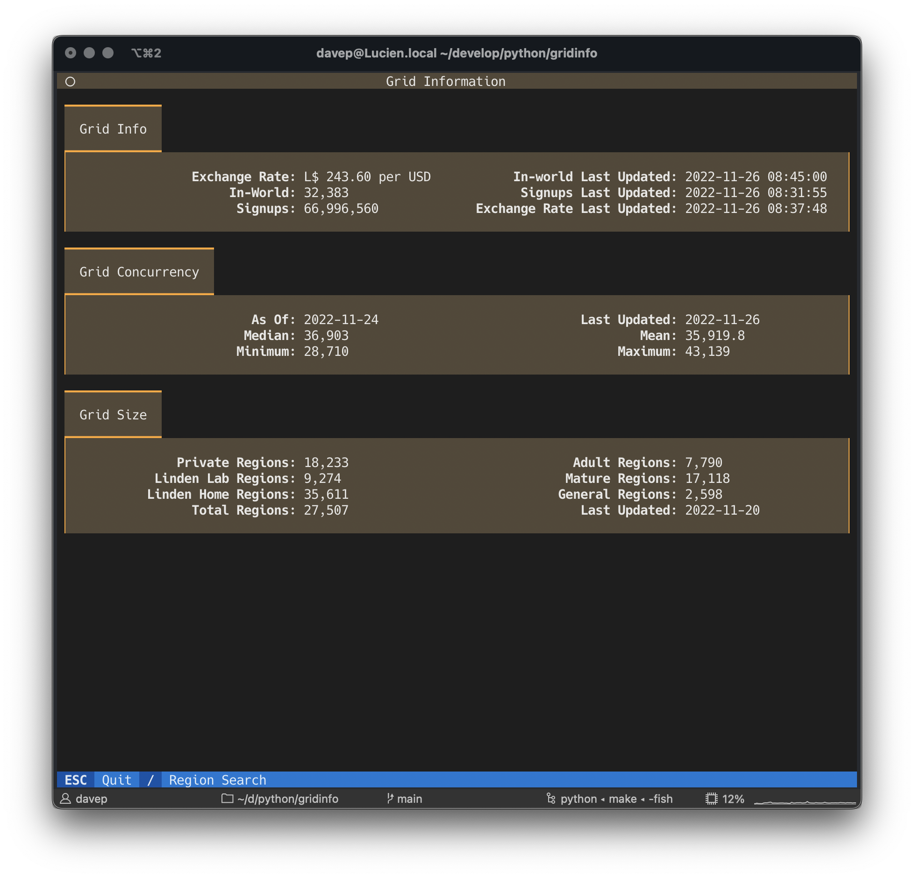
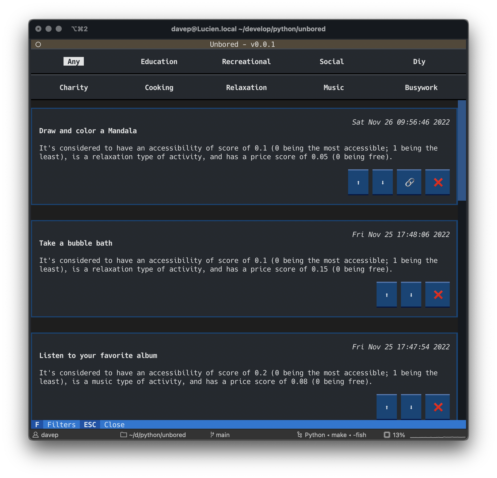

# On dog food, the (original) Metaverse, and (not) being bored

## Introduction

!!! quote

    Cutler, armed with a schedule, was urging the team to "eat its own dog
    food". Part macho stunt and part common sense, the "dog food diet" was the
    cornerstone of Cutler’s philosophy.

    <cite>G. Pascal Zachary &mdash; Show-Stopper!</cite>

I can't remember exactly when it was -- it was likely late in 1994 or some
time in 1995 -- when I first came across the concept of, or rather the name
for the concept of, *"eating your own dog food"*. The idea and the name
played a huge part in the book [*Show-Stopper!* by G. Pascal
Zachary](https://www.gpascalzachary.com/showstopper__the_breakneck_race_to_create_windows_nt_and_the_next_generation_at_m_50101.htm).
The idea wasn't new to me of course; I'd been writing code for over a decade
by then and plenty of times I'd built things and then used those things to
do things, but it was fascinating to a mostly-self-taught 20-something me to
be reading this (excellent -- go read it if you care about the history of
your craft) book and to see the idea written down and named.

<!-- more -->

While [Textualize](https://www.textualize.io/) isn't (thankfully -- really,
I do recommend reading the book) anything like working on the team building
Windows NT, the idea of taking a little time out from working *on* Textual,
and instead work *with* Textual, makes a lot of sense. It's far too easy to
get focused on adding things and improving things and tweaking things while
losing sight of the fact that people will want to build **with** your
product.

So you can imagine how pleased I was when
[Will](https://mastodon.social/@willmcgugan) announced that he wanted [all
of us](https://www.textualize.io/about-us) to spend a couple or so weeks
building something with Textual. I had, of course, already written [one
small application with the
library](https://github.com/Textualize/textual/blob/main/examples/five_by_five.py),
and had plans for another (in part [it's how I ended up working
here](https://blog.davep.org/2022/10/05/on-to-something-new-redux.html)),
but I'd yet to really dive in and try and build something more involved.

Giving it some thought: I wasn't entirely sure what I wanted to build
though. I do want to use Textual to build a brand new terminal-based Norton
Guide reader ([not my first](https://github.com/davep/eg), not by [a long
way](https://github.com/davep/eg-OS2)) but I felt that was possibly a bit
too niche, and actually could take a bit too long anyway. Maybe not, it
remains to be seen.

Eventually I decided on this approach: try and do a quick prototype of some
daft idea each day or each couple of days, do that for a week or so, and
then finally try and settle down on something less trivial. This approach
should work well in that it'll help introduce me to more of Textual, help
try out a few different parts of the library, and also hopefully discover
some real pain-points with working with it and highlight a list of issues we
should address -- as seen from the perspective of a developer working with
the library.

So, here I am, at the end of week one. What I want to try and do is briefly
(yes yes, I know, this introduction is the antithesis of brief) talk about
what I built and perhaps try and highlight some lessons learnt, highlight
some patterns I think are useful, and generally do an end-of-week version of
a [TIL](https://simonwillison.net/2022/Nov/6/what-to-blog-about/). TWIL?

Yeah. I guess this is a TWIL.

## gridinfo

I started the week by digging out a quick hack I'd done a couple of weeks
earlier, with a view to cleaning it up. It started out as a fun attempt to
do something with [Rich Pixels](https://github.com/darrenburns/rich-pixels)
while also making a terminal-based take on
[`slstats.el`](https://github.com/davep/slstats.el). I'm actually pleased
with the result and how quickly it came together.

The point of the application itself is to show some general information
about the current state of the Second Life grid (hello to any fellow
residents of [the original
Metaverse](https://wiki.secondlife.com/wiki/History_of_Second_Life)!), and
to also provide a simple region lookup screen that, using Rich Pixels, will
display the object map (albeit in pretty low resolution -- but that's the
fun of this!).

So the opening screen looks like this:



and a lookup of a region looks like this:


Here's a wee video of the whole thing in action:

<div class="video-wrapper">
    <iframe
        width="560" height="315"
        src="https://www.youtube.com/embed/dzpGgVPD2aM"
        title="YouTube video player"
        frameborder="0"
        allow="accelerometer; autoplay; clipboard-write; encrypted-media; gyroscope; picture-in-picture"
        allowfullscreen>
    </iframe>
</div>

### Worth a highlight

Here's a couple of things from the code that I think are worth a highlight,
as things to consider when building Textual apps:

#### Don't use the default screen

Use of the default `Screen` that's provided by the `App` is handy enough,
but I feel any non-trivial application should really put as much code as
possible in screens that relate to key "work". Here's the entirety of my
application code:

```python
class GridInfo( App[ None ] ):
    """TUI app for showing information about the Second Life grid."""

    CSS_PATH = "gridinfo.css"
    """The name of the CSS file for the app."""

    TITLE = "Grid Information"
    """str: The title of the application."""

    SCREENS = {
        "main": Main,
        "region": RegionInfo
    }
    """The collection of application screens."""

    def on_mount( self ) -> None:
        """Set up the application on startup."""
        self.push_screen( "main" )
```

You'll notice there's no work done in the app, other than to declare the
screens, and to set the `main` screen running when the app is mounted.

#### Don't work hard `on_mount`

My initial version of the application had it loading up the data from the
Second Life and GridSurvey APIs in `Main.on_mount`. This obviously wasn't a
great idea as it made the startup appear slow. That's when I realised just
how handy
[`call_after_refresh`](https://textual.textualize.io/api/message_pump/#textual.message_pump.MessagePump.call_after_refresh)
is. This meant I could show some placeholder information and then fire off
the requests (3 of them: one to get the main grid information, one to get
the grid concurrency data, and one to get the grid size data), keeping the
application looking active and updating the display when the replies came
in.

### Pain points

While building this app I think there was only really the one pain-point,
and I suspect it's mostly more on me than on Textual itself: getting a good
layout and playing whack-a-mole with CSS. I suspect this is going to be down
to getting more and more familiar with CSS and the terminal (which is
different from laying things out for the web), while also practising with
various layout schemes -- which is where the [revamped `Placeholder`
class](https://textual.textualize.io/blog/2022/11/22/what-i-learned-from-my-first-non-trivial-pr/#what-i-learned-from-my-first-non-trivial-pr)
is going to be really useful.

## unbored

The next application was initially going to be a very quick hack, but
actually turned into a less-trivial build than I'd initially envisaged; not
in a negative way though. The more I played with it the more I explored and
I feel that this ended up being my first really good exploration of some
useful (personal -- your kilometerage may vary) patterns and approaches when
working with Textual.

The application itself is a terminal client for [the
Bored-API](https://www.boredapi.com/). I had initially intended to roll my
own code for working with the API, but I noticed that [someone had done a
nice library for it](https://pypi.org/project/bored-api/) and it seemed
silly to not build on that. Not needing to faff with that, I could
concentrate on the application itself.

At first I was just going to let the user click away at a button that showed
a random activity, but this quickly morphed into a *"why don't I make this
into a sort of TODO list builder app, where you can add things to do when
you are bored, and delete things you don't care for or have done"* approach.

Here's a view of the main screen:



and here's a view of the filter pop-over:


### Worth a highlight

#### Don't put all your `BINDINGS` in one place

This came about from me overloading the use of the `escape` key. I wanted it
to work more or less like this:

- If you're inside an activity, move focus up to the activity type selection
  buttons.
- If the filter pop-over is visible, close that.
- Otherwise exit the application.

It was easy enough to do, and I had an action in the `Main` screen that
`escape` was bound to (again, in the `Main` screen) that did all this logic
with some `if`/`elif` work but it didn't feel elegant. Moreover, it meant
that the `Footer` always displayed the same description for the key.

That's when I realised that it made way more sense to have a `Binding` for
`escape` in every widget that was the actual context for escape's use. So I
went from one top-level binding to...

```python
...

class Activity( Widget ):
    """A widget that holds and displays a suggested activity."""

    BINDINGS = [
        ...
        Binding( "escape", "deselect", "Switch to Types" )
    ]

...

class Filters( Vertical ):
    """Filtering sidebar."""

    BINDINGS = [
        Binding( "escape", "close", "Close Filters" )
    ]

...

class Main( Screen ):
    """The main application screen."""

    BINDINGS = [
        Binding( "escape", "quit", "Close" )
    ]
    """The bindings for the main screen."""
```

This was so much cleaner **and** I got better `Footer` descriptions too. I'm
going to be leaning hard on this approach from now on.

#### Messages are awesome

Until I wrote this application I hadn't really had a need to define or use
my own `Message`s. During work on this I realised how handy they really are.
In the code I have an `Activity` widget which takes care of the job of
moving itself amongst its siblings if the user asks to move an activity up
or down. When this happens I also want the `Main` screen to save the
activities to the filesystem as things have changed.

Thing is: I don't want the screen to know what an `Activity` is capable of
and I don't want an `Activity` to know what the screen is capable of;
especially the latter as I really don't want a child of a screen to know
what the screen can do (in this case *"save stuff"*).

This is where messages come in. Using a message I could just set things up
so that the `Activity` could shout out **"HEY I JUST DID A THING THAT CHANGES
ME"** and not care who is listening and not care what they do with that
information.

So, thanks to this bit of code in my `Activity` widget...

```python
    class Moved( Message ):
        """A message to indicate that an activity has moved."""

    def action_move_up( self ) -> None:
        """Move this activity up one place in the list."""
        if self.parent is not None and not self.is_first:
            parent = cast( Widget, self.parent )
            parent.move_child(
                self, before=parent.children.index( self ) - 1
            )
            self.emit_no_wait( self.Moved( self ) )
            self.scroll_visible( top=True )
```

...the `Main` screen can do this:

```python
    def on_activity_moved( self, _: Activity.Moved ) -> None:
        """React to an activity being moved."""
        self.save_activity_list()
```

!!! warning

    The code above used `emit_no_wait`. Since this blog post was first
    published that method has been removed from Textual. You should use
    [`post_message_no_wait` or `post_message`](/guide/events/#sending-messages) instead now.

### Pain points

On top of the issues of getting to know terminal-based-CSS that I mentioned
earlier:

- Textual currently lacks any sort of selection list or radio-set widget.
  This meant that I couldn't quite do the activity type picking how I would
  have wanted. Of course I could have rolled my own widgets for this, but I
  think I'd sooner wait until such things [are in Textual
  itself](https://textual.textualize.io/roadmap/#widgets).
- Similar to that, I could have used some validating `Input` widgets. They
  too are on the roadmap but I managed to cobble together fairly good
  working versions for my purposes. In doing so though I did further
  highlight that the [reactive attribute
  facility](https://textual.textualize.io/tutorial/#reactive-attributes)
  needs a wee bit more attention as I ran into some
  ([already-known](https://github.com/Textualize/textual/issues/1216)) bugs.
  Thankfully in my case [it was a very easy
  workaround](https://github.com/davep/unbored/blob/d46f7959aeda0996f39d287388c6edd2077be935/unbored#L251-L255).
- Scrolling in general seems a wee bit off when it comes to widgets that are
  more than one line tall. While there's nothing really obvious I can point
  my finger at, I'm finding that scrolling containers sometimes get confused
  about what should be in view. This becomes very obvious when forcing
  things to scroll from code. I feel this deserves a dedicated test
  application to explore this more.

## Conclusion

The first week of *"dogfooding"* has been fun and I'm more convinced than
ever that it's an excellent exercise for Textualize to engage in. I didn't
quite manage my plan of *"one silly trivial prototype per day"*, which means
I've ended up with two (well technically one and a half I guess given that
`gridinfo` already existed as a prototype) applications rather than four.
I'm okay with that. I got a **lot** of utility out of this.

Now to look at the list of ideas I have going and think about what I'll kick
next week off with...
