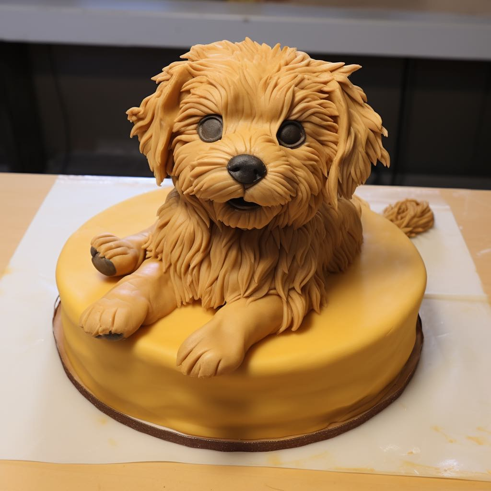

# Pull Requests are cake or puppies

Broadly speaking, there are two types of contributions you can make to an Open Source project.

<!-- more -->

The first type is typically a bug fix, but could also be a documentation update, linting fix, or other change which doesn't impact core functionality.
Such a contribution is like *cake*.
It's a simple, delicious, gift to the project.

The second type of contribution often comes in the form of a new feature.
This contribution likely represents a greater investment of time and effort than a bug fix.
It is still a gift to the project, but this contribution is *not* cake.

A feature PR has far more in common with a puppy.
The maintainer(s) may really like the feature but hesitate to merge all the same.
They may even reject the contribution entirely.
This is because a feature PR requires an ongoing burden to maintain.
In the same way that a puppy needs food and walkies, a new feature will require updates and fixes long after the original contribution.
Even if it is an amazing feature, the maintainer may not want to commit to that ongoing work.

The chances of a feature being merged can depend on the maturity of the project.
At the beginning of a project, a maintainer may be delighted with a new feature contribution.
After all, having others join you to build something is the joy of Open Source.
And yet when a project gets more mature there may be a growing resistance to adding new features, and a greater risk that a feature PR is rejected or sits unappreciated in the PR queue.

So how should a contributor avoid this?
If there is any doubt, it's best to propose the feature to the maintainers before undertaking the work.
In all likelihood they will be happy for your contribution, just be prepared for them to say "thanks but no thanks".
Don't take it as a rejection of your gift: it's just that the maintainer can't commit to taking on a puppy.

There are other ways to contribute code to a project that don't require the code to be merged in to the core.
You could publish your change as a third party library.
Take it from me: maintainers love it when their project spawns an ecosystem.
You could also blog about how you solved your problem without an update to the core project.
Having a resource that can be googled for, or a maintainer can direct people to, can be a huge help.

What prompted me to think about this is that my two main projects, [Rich](https://github.com/Textualize/rich) and [Textual](https://github.com/Textualize/textual), are at quite different stages in their lifetime. Rich is relatively mature, and I'm unlikely to accept a puppy. If you can achieve what you need without adding to the core library, I am *probably* going to decline a new feature. Textual is younger and still accepting puppies &mdash; in addition to stick insects, gerbils, capybaras and giraffes.

!!! tip

    If you are maintainer, and you do have to close a feature PR, feel free to link to this post.

---

Join us on the [Discord Server](https://discord.gg/Enf6Z3qhVr) if you want to discuss puppies and other creatures.
