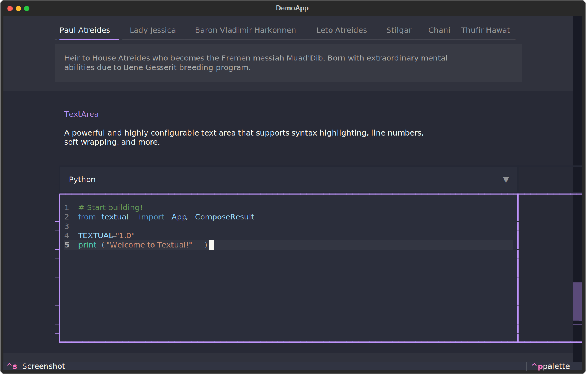

I've had the fortune of being able to work fulltime on a FOSS project for the last three plus years.


!!! tip inline end "Textual Demo"

    [](https://github.com/textualize/textual-demo)


Textual has been a constant source of programming challenges.
Often frustrating but never boring, the challenges arise because the terminal "specification" says nothing about how to build a modern User Interface.
The building blocks are there.
After some effort you can move the cursor, write colored text, read keys and mouse coordinates, but that's about it.
Everything else we had to build from scratch: from the most basic [button](https://textual.textualize.io/widget_gallery/#button) to a syntax highlighted [TextArea](https://textual.textualize.io/widget_gallery/#textarea), and everything along the way.

I wanted to write-up some of the more interesting solutions we came up with for a while.
The 1.0 milestone we just passed makes this the perfect time.

If you haven't followed along with Textual's development, here is a demo of what it can do.
This is a Textual app, running remotely, served by your browser:

<a href="https://textual-web.io/textualize/demo" target="_blank">
Launch Textual Demo
</a>

I cheaped out on the VMs &mdash; so if the demo is down, you could run it locally (with [uv](https://docs.astral.sh/uv/)):

```
uvx --python 3.12 textual-demo
```


## The Compositor

The first component of Textual I want to cover is the *compositor*.
The job of the compositor is to combine widgets in to a single view.

We do this because the terminal itself has no notion of overlapping windows in the way a desktop does.
If an app wants to display overlapping components it must combine them into a single update.

Here's a video I generated over a year ago, demonstrating the output of the compositor:

<div class="video-wrapper">
<iframe width="100%" height="auto" src="https://www.youtube.com/embed/T8PZjUVVb50" title="" frameborder="0" allow="accelerometer; autoplay; clipboard-write; encrypted-media; gyroscope; picture-in-picture; web-share" allowfullscreen></iframe>
</div>

### The algorithm

You could be forgiven in thinking that the terminal is regular grid of characters and we can treat it like a 2D array.
If that were the case, we could use [painter's algorithm](https://en.wikipedia.org/wiki/Painter's_algorithm) to handle the overlapping widgets.
In other words, sort them back to front and render them as though they were bitmaps.

Unfortunately the terminal is *not* a true grid.
Some characters such as CJK (Chinese, Japanese, and Korean) and many emoji are double the width of latin alphabet characters &mdash; which complicates things (to put it mildly).

Textual's way of handling this is inherited from [Rich](https://github.com/Textualize/rich).
Anything you print in Rich, first generates a list of [Segments](https://github.com/Textualize/rich/blob/master/rich/segment.py) which consist of a string and associated style.
These Segments are only converted into text with [ansi escape codes](https://en.wikipedia.org/wiki/ANSI_escape_code) at the very last moment.


Textual works with same Segment object.
Widgets all produce a list of segments, which is further processed by the compositor.

!!! tip "Switch the Primitive"
    
    If a problem is intractable, it can often be simplified by changing what you consider to be the fundamental atomic data and operations you are working with.
    I call this "switching the primitive".

### Thinking in Segments 

In the following illustration we have an app with three widgets; the background "screen" (in blue) plus two floating widgets (in red and green).
There will be many more widgets in a typical app, but this is enough to show how it works.


<div class="excalidraw">
--8<-- "docs/blog/images/compositor/widgets.excalidraw.svg"
</div>

The lines are lists of Segments produced by the widget renderer.
The compositor will combine those lists in to a single list where nothing overlaps.

To illustrate how this process works, let's consider the highlighted line about a quarter of the way down.


### Compositing a line

Imagine you could view the terminal and widgets side on, so that you see a cross section of the terminal and the floating widgets.
It would appear something like the following:

<div class="excalidraw">
--8<-- "docs/blog/images/compositor/cuts0.excalidraw.svg"
</div>

We can't yet display the output as it would require writing each "layer" independantly, potentially making the terminal flicker, and certainly writing more data than neccesary.

We need a few more steps to combine these lines in to a single line.


### Step 1. Finding the cuts.

First thing the compositor does is to find every offset where a list of segments begins or ends.

<div class="excalidraw">
--8<-- "docs/blog/images/compositor/cuts1.excalidraw.svg"
</div>

### Step 2. Applying the cuts.

The next step is to divide every list of segments at the cut offsets.
This will produce smaller lists of segments, which in the compositor code we refer to as *chops*.

<div class="excalidraw">
--8<-- "docs/blog/images/compositor/cuts2.excalidraw.svg"
</div>

These chops have the property that nothing overlaps, which is important for the next step.

### Step 3. Discard chops.

Only the top-most chops will actually be visible to the viewer.
Anything not at the top can simply be thrown away.

<div class="excalidraw">
--8<-- "docs/blog/images/compositor/cuts3.excalidraw.svg"
</div>

### Step 4. Combine.

Now all that's left is to combine the top-most chops in to a single list of Segments. It is this list of segments that becomes a line in the terminal.

<div class="excalidraw">
--8<-- "docs/blog/images/compositor/cuts4.excalidraw.svg"
</div>

this is done for ever line in the output.
At the end of it we have a list of segments for each line, ready to be converted in to escape sequences and written to the terminal.

### What I omitted

There is more going on than this explanation may suggest.
Widgets may contain other widgets which are clipped to their *parent's* boundaries, and widgets that contain other widgets may also scroll &mdash; the compositor must take all of this in to account.

Additionally, the compositor can do partial updates.
In other words, if you click a button and it changes color the compositor can update just that button.

The compositor does all of this fast enough to enable smooth scrolling, even with a metric tonne of widgets on screen.
