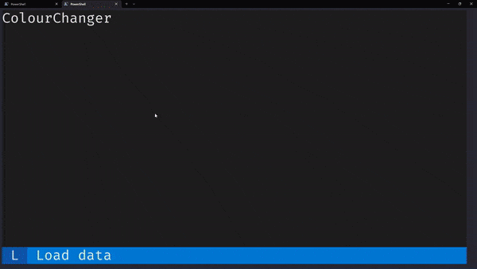
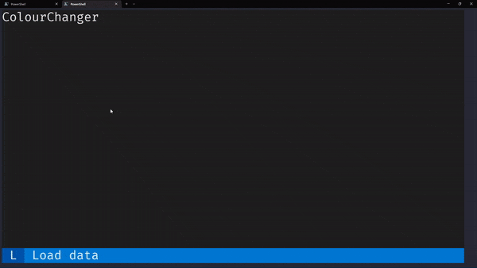

# Letting your cook multitask while bringing water to a boil

Whenever you are cooking a time-consuming meal, you want to multitask as much as possible.
For example, you **do not** want to stand still while you wait for a pot of water to start boiling.
Similarly, you want your applications to remain responsive (i.e., you want the cook to “multitask”) while they do some time-consuming operations in the background (e.g., while the water heats up).

The animation below shows an example of an application that remains responsive (colours on the left still change on click) even while doing a bunch of time-consuming operations (shown on the right).



In this blog post, I will teach you how to multitask like a good cook.

<!-- more -->


## Wasting time staring at pots

There is no point in me presenting a solution to a problem if you don't understand the problem I am trying to solve.
Suppose we have an application that needs to display a huge amount of data that needs to be read and parsed from a file.
The first time I had to do something like this, I ended up writing an application that “blocked”.
This means that _while_ the application was reading and parsing the data, nothing else worked.

To exemplify this type of scenario, I created a simple application that spends five seconds preparing some data.
After the data is ready, we display a `Label` on the right that says that the data has been loaded.
On the left, the app has a big rectangle (a custom widget called `ColourChanger`) that you can click and that changes background colours randomly.

When you start the application, you can click the rectangle on the left to change the background colour of the `ColourChanger`, as the animation below shows:



However, as soon as you press `l` to trigger the data loading process, clicking the `ColourChanger` widget doesn't do anything.
The app doesn't respond because it is busy working on the data.
This is the code of the app so you can try it yourself:

```py hl_lines="11-13 21 35 36"
--8<-- "docs/blog/snippets/2022-12-07-responsive-app-background-task/blocking01.py"
```

1. The widget `ColourChanger` changes colours, randomly, when clicked.
2. We create a binding to the key `l` that runs an action that we know will take some time (for example, reading and parsing a huge file).
3. The method `action_load` is responsible for starting our time-consuming task and then reporting back.
4. To simplify things a bit, our “time-consuming task” is just standing still for 5 seconds.

I think it is easy to understand why the widget `ColourChanger` stops working when we hit the `time.sleep` call if we consider [the cooking analogy](https://mathspp.com/blog/til/cooking-with-asyncio) I have written about before in my blog.
In short, Python behaves like a lone cook in a kitchen:

 - the cook can be clever and multitask. For example, while water is heating up and being brought to a boil, the cook can go ahead and chop some vegetables.
 - however, there is _only one_ cook in the kitchen, so if the cook is chopping up vegetables, they can't be seasoning a salad.

Things like “chopping up vegetables” and “seasoning a salad” are _blocking_, i.e., they need the cook's time and attention.
In the app that I showed above, the call to `time.sleep` is blocking, so the cook can't go and do anything else until the time interval elapses.

## How can a cook multitask?

It makes a lot of sense to think that a cook would multitask in their kitchen, but Python isn't like a smart cook.
Python is like a very dumb cook who only ever does one thing at a time and waits until each thing is completely done before doing the next thing.
So, by default, Python would act like a cook who fills up a pan with water, starts heating the water, and then stands there staring at the water until it starts boiling instead of doing something else.
It is by using the module `asyncio` from the standard library that our cook learns to do other tasks while _awaiting_ the completion of the things they already started doing.

[Textual](https://github.com/textualize/textual) is an async framework, which means it knows how to interoperate with the module `asyncio` and this will be the solution to our problem.
By using `asyncio` with the tasks we want to run in the background, we will let the application remain responsive while we load and parse the data we need, or while we crunch the numbers we need to crunch, or while we connect to some slow API over the Internet, or whatever it is you want to do.

The module `asyncio` uses the keyword `async` to know which functions can be run asynchronously.
In other words, you use the keyword `async` to identify functions that contain tasks that would otherwise force the cook to waste time.
(Functions with the keyword `async` are called _coroutines_.)

The module `asyncio` also introduces a function `asyncio.create_task` that you can use to run coroutines concurrently.
So, if we create a coroutine that is in charge of doing the time-consuming operation and then run it with `asyncio.create_task`, we are well on our way to fix our issues.

However, the keyword `async` and `asyncio.create_task` alone aren't enough.
Consider this modification of the previous app, where the method `action_load` now uses `asyncio.create_task` to run a coroutine who does the sleeping:

```py hl_lines="36-37 39"
--8<-- "docs/blog/snippets/2022-12-07-responsive-app-background-task/blocking02.py"
```

1. The action method `action_load` now defers the heavy lifting to another method we created.
2. The time-consuming operation can be run concurrently with `asyncio.create_task` because it is a coroutine.
3. The method `_do_long_operation` has the keyword `async`, so it is a coroutine.

This modified app also works but it suffers from the same issue as the one before!
The keyword `async` tells Python that there will be things inside that function that can be _awaited_ by the cook.
That is, the function will do some time-consuming operation that doesn't require the cook's attention.
However, we need to tell Python which time-consuming operation doesn't require the cook's attention, i.e., which time-consuming operation can be _awaited_, with the keyword `await`.

Whenever we want to use the keyword `await`, we need to do it with objects that are compatible with it.
For many things, that means using specialised libraries:

 - instead of `time.sleep`, one can use `await asyncio.sleep`;
 - instead of the module `requests` to make Internet requests, use `aiohttp`; or
 - instead of using the built-in tools to read files, use `aiofiles`.

## Achieving good multitasking

To fix the last example application, all we need to do is replace the call to `time.sleep` with a call to `asyncio.sleep` and then use the keyword `await` to signal Python that we can be doing something else while we sleep.
The animation below shows that we can still change colours while the application is completing the time-consuming operation.

=== "Code"

    ```py hl_lines="40 41 42"
    --8<-- "docs/blog/snippets/2022-12-07-responsive-app-background-task/nonblocking01.py"
    ```

    1. We create a label that tells the user that we are starting our time-consuming operation.
    2. We `await` the time-consuming operation so that the application remains responsive.
    3. We create a label that tells the user that the time-consuming operation has been concluded.

=== "Animation"

    

Because our time-consuming operation runs concurrently, everything else in the application still works while we _await_ for the time-consuming operation to finish.
In particular, we can keep changing colours (like the animation above showed) but we can also keep activating the binding with the key `l` to start multiple instances of the same time-consuming operation!
The animation below shows just this:


!!! warning

    The animation GIFs in this blog post show low-quality colours in an attempt to reduce the size of the media files you have to download to be able to read this blog post.
    If you run Textual locally you will see beautiful colours ✨
