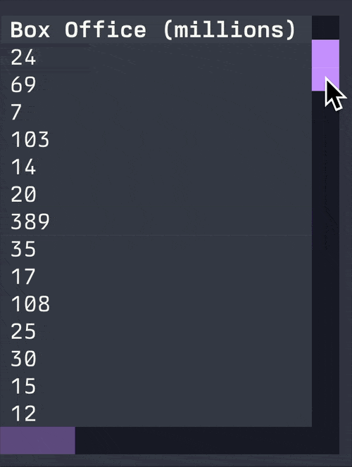

# Smoother scrolling in the terminal &mdash; a feature decades in the making

The great philosopher F. Bueller once said “Life moves pretty fast. If you don't stop and look around once in a while, you could miss it.”

Beuller was *not* taking about terminals, which tend not to move very fast at all.
Until they do.
From time to time terminals acquire new abilities after a long plateau.
We are now seeing a kind of punctuated evolution in terminals which makes things possible that just weren't feasible a short time ago.

I want to talk about one such feature, which *I believe* has been decades[^1] in the making.
Take a look at the following screen recording (taken from a TUI running in the terminal):

<!-- more -->

Note how the mouse pointer moves relatively smoothly, but the scrollbar jumps with a jerky motion.

This happens because the terminal reports the mouse coordinates in cells (a *cell* is the dimensions of a single latin-alphabet character). 
In other words, the app knows only which cell is under the pointer.
It isn't granular enough to know where the pointer is *within* a cell.

Until recently terminal apps couldn't do any better.
More granular mouse reporting is possible in the terminal; write the required escape sequence and mouse coordinates are reported in pixels rather than cells.
So why haven't TUIs been using this?

The problem is that we can't translate between pixel coordinates and cell coordinates without first knowing how many pixels are in a cell.
And in order to know that, we need to know the width and height of the terminal in *pixels*.
Unfortunately, that standard way to get the terminal size reports just cells.

At least they didn't before [this extension](https://gist.github.com/rockorager/e695fb2924d36b2bcf1fff4a3704bd83) which reports the size of the terminal in cell *and* pixel coordinates.
Once we have both the mouse coordinates in pixels and the dimensions of the terminal in pixels, we can implement much smoother scrolling.

Let's see how this looks.

On the right we have smooth scrolling enabled, on the left is the default non-smooth scrolling:

| Default scrolling                                                | Smooth scrolling                                                                    |
| ---------------------------------------------------------------- | ----------------------------------------------------------------------------------- |
|  |  |

Notice how much smoother the motion of the table is, now that it tracks the mouse cursor more accurately.
If you move the scrollbar quickly, you may not notice the difference.
But if you move slowly like you are searching for something, it is a respectable quality of life improvement.

If you have one of the terminals which support this feature[^2], and at least [Textual](https://github.com/textualize/textual/) 2.0.0 you will be able to see this in action.

I think Textual may be the first library to implement this.
Let me know, if you have encountered any non-Textual TUI app which implements this kind of smooth scrolling.

## Join us

Join our [Discord server](https://discord.gg/Enf6Z3qhVr) to discuss anything terminal related with the Textualize devs, or the community!

[^1]: I'm not sure exactly when pixel mouse reporting was added to terminals. I'd be interested if anyone has a precised date.
[^2]: Kitty, Ghostty, and a few others.
