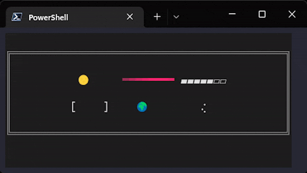
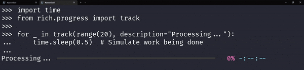
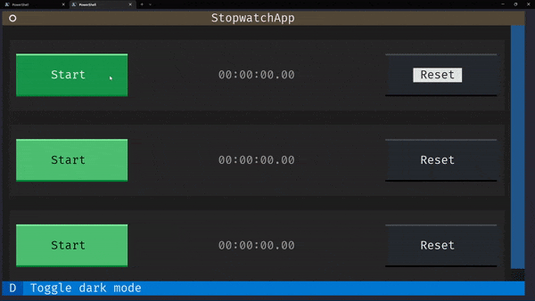
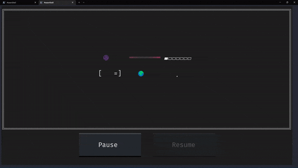
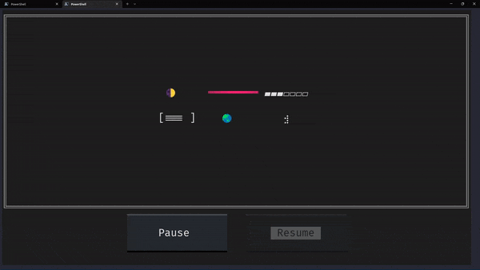
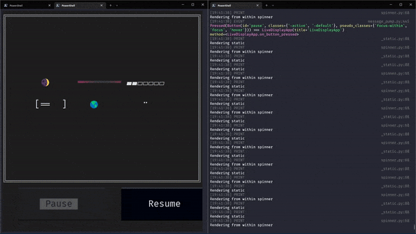

# Spinners and progress bars in Textual



One of the things I love about mathematics is that you can solve a problem just by **guessing** the correct answer.
That is a perfectly valid strategy for solving a problem.
The only thing you need to do after guessing the answer is to prove that your guess is correct.

I used this strategy, to some success, to display spinners and indeterminate progress bars from [Rich](github.com/textualize/rich) in [Textual](https://github.com/textualize/textual).

<!-- more -->


## Display an indeterminate progress bar in Textual

I have been playing around with Textual and recently I decided I needed an indeterminate progress bar to show that some data was loading.
Textual is likely to [get progress bars in the future](https://github.com/Textualize/rich/issues/2665#issuecomment-1326229220), but I don't want to wait for the future!
I want my progress bars now!
Textual builds on top of Rich, so if [Rich has progress bars](https://rich.readthedocs.io/en/stable/progress.html), I reckoned I could use them in my Textual apps.


### Progress bars in Rich

Creating a progress bar in Rich is as easy as opening up the documentation for `Progress` and copying & pasting the code.


=== "Code"

    ```py
    import time
    from rich.progress import track

    for _ in track(range(20), description="Processing..."):
        time.sleep(0.5)  # Simulate work being done
    ```

=== "Output"

    


The function `track` provides a very convenient interface for creating progress bars that keep track of a well-specified number of steps.
In the example above, we were keeping track of some task that was going to take 20 steps to complete.
(For example, if we had to process a list with 20 elements.)
However, I am looking for indeterminate progress bars.

Scrolling further down the documentation for `rich.progress` I found what I was looking for:

=== "Code"

    ```py hl_lines="5"
    import time
    from rich.progress import Progress

    with Progress() as progress:
        _ = progress.add_task("Loading...", total=None)  # (1)!
        while True:
            time.sleep(0.01)
    ```

    1. Setting `total=None` is what makes it an indeterminate progress bar.

=== "Output"

    

So, putting an indeterminate progress bar on the screen is _easy_.
Now, I only needed to glue that together with the little I know about Textual to put an indeterminate progress bar in a Textual app.


### Guessing what is what and what goes where

What I want is to have an indeterminate progress bar inside my Textual app.
Something that looks like this:


The GIF above shows just the progress bar.
Obviously, the end goal is to have the progress bar be part of a Textual app that does something.

So, when I set out to do this, my first thought went to the stopwatch app in the [Textual tutorial](https://textual.textualize.io/tutorial) because it has a widget that updates automatically, the `TimeDisplay`.
Below you can find the essential part of the code for the `TimeDisplay` widget and a small animation of it updating when the stopwatch is started.


=== "`TimeDisplay` widget"

    ```py hl_lines="14 18 22"
    from time import monotonic

    from textual.reactive import reactive
    from textual.widgets import Static


    class TimeDisplay(Static):
        """A widget to display elapsed time."""

        start_time = reactive(monotonic)
        time = reactive(0.0)
        total = reactive(0.0)

        def on_mount(self) -> None:
            """Event handler called when widget is added to the app."""
            self.update_timer = self.set_interval(1 / 60, self.update_time, pause=True)

        def update_time(self) -> None:
            """Method to update time to current."""
            self.time = self.total + (monotonic() - self.start_time)

        def watch_time(self, time: float) -> None:
            """Called when the time attribute changes."""
            minutes, seconds = divmod(time, 60)
            hours, minutes = divmod(minutes, 60)
            self.update(f"{hours:02,.0f}:{minutes:02.0f}:{seconds:05.2f}")
    ```

=== "Output"

    


The reason the time display updates magically is due to the three methods that I highlighted in the code above:

 1. The method `on_mount` is called when the `TimeDisplay` widget is mounted on the app and, in it, we use the method `set_interval` to let Textual know that every `1 / 60` seconds we would like to call the method `update_time`. (In other words, we would like `update_time` to be called 60 times per second.)
 2. In turn, the method `update_time` (which is called _automatically_ a bunch of times per second) will update the reactive attribute `time`. _When_ this attribute update happens, the method `watch_time` kicks in.
 3. The method `watch_time` is a watcher method and gets called whenever the attribute `self.time` is assigned to.
 So, if the method `update_time` is called a bunch of times per second, the watcher method `watch_time` is also called a bunch of times per second. In it, we create a nice representation of the time that has elapsed and we use the method `update` to update the time that is being displayed.

I thought it would be reasonable if a similar mechanism needed to be in place for my progress bar, but then I realised that the progress bar seems to update itself...
Looking at the indeterminate progress bar example from before, the only thing going on was that we used `time.sleep` to stop our program for a bit.
We didn't do _anything_ to update the progress bar...
Look:

```py
with Progress() as progress:
    _ = progress.add_task("Loading...", total=None)  # (1)!
    while True:
        time.sleep(0.01)
```

After pondering about this for a bit, I realised I would not need a watcher method for anything.
The watcher method would only make sense if I needed to update an attribute related to some sort of artificial progress, but that clearly isn't needed to get the bar going...

At some point, I realised that the object `progress` is the object of interest.
At first, I thought `progress.add_task` would return the progress bar, but it actually returns the integer ID of the task added, so the object of interest is `progress`.
Because I am doing nothing to update the bar explicitly, the object `progress` must be updating itself.

The Textual documentation also says that we can [build widgets from Rich renderables](https://textual.textualize.io/guide/widgets/#rich-renderables), so I concluded that if `Progress` were a renderable, then I could inherit from `Static` and use the method `update` to update the widget with my instance of `Progress` directly.
I gave it a try and I put together this code:

```py hl_lines="10 11 15-17 20"
from rich.progress import Progress, BarColumn

from textual.app import App, ComposeResult
from textual.widgets import Static


class IndeterminateProgress(Static):
    def __init__(self):
        super().__init__("")
        self._bar = Progress(BarColumn())  # (1)!
        self._bar.add_task("", total=None)  # (2)!

    def on_mount(self) -> None:
        # When the widget is mounted start updating the display regularly.
        self.update_render = self.set_interval(
            1 / 60, self.update_progress_bar
        )  # (3)!

    def update_progress_bar(self) -> None:
        self.update(self._bar)  # (4)!


class MyApp(App):
    def compose(self) -> ComposeResult:
        yield IndeterminateProgress()


if __name__ == "__main__":
    app = MyApp()
    app.run()
```

 1. Create an instance of `Progress` that just cares about the bar itself (Rich progress bars can have a label, an indicator for the time left, etc).
 2. We add the indeterminate task with `total=None` for the indeterminate progress bar.
 3. When the widget is mounted on the app, we want to start calling `update_progress_bar` 60 times per second.
 4. To update the widget of the progress bar we just call the method `Static.update` with the `Progress` object because `self._bar` is a Rich renderable.

And lo and behold, it worked:


### Proving it works

I finished writing this piece of code and I was ecstatic because it was working!
After all, my Textual app starts and renders the progress bar.
And so, I shared this simple app with someone who wanted to do a similar thing, but I was left with a bad taste in my mouth because I couldn't really connect all the dots and explain exactly why it worked.

!!! warning "Plot twist"

    By the end of the blog post, I will be much closer to a full explanation!


## Display a Rich spinner in a Textual app

A day after creating my basic `IndeterminateProgress` widget, I found someone that was trying to display a Rich spinner in a Textual app.
Actually, it was someone that had [filed an issue against Rich](https://github.com/Textualize/rich/issues/2665).
They didn't ask “how can I display a Rich spinner in a Textual app?”, but they filed an alleged bug that crept up on them _when_ they tried displaying a spinner in a Textual app.

When reading the issue I realised that displaying a Rich spinner looked very similar to displaying a Rich progress bar, so I made a tiny change to my code and tried to run it:

=== "Code"

    ```py hl_lines="10"
    from rich.spinner import Spinner

    from textual.app import App, ComposeResult
    from textual.widgets import Static


    class SpinnerWidget(Static):
        def __init__(self):
            super().__init__("")
            self._spinner = Spinner("moon")  # (1)!

        def on_mount(self) -> None:
            self.update_render = self.set_interval(1 / 60, self.update_spinner)

        def update_spinner(self) -> None:
            self.update(self._spinner)


    class MyApp(App[None]):
        def compose(self) -> ComposeResult:
            yield SpinnerWidget()


    MyApp().run()
    ```

    1. Instead of creating an instance of `Progress`, we create an instance of `Spinner` and save it so we can call `self.update(self._spinner)` later on.

=== "Spinner running"

    


## Losing the battle against pausing the animations

After creating the progress bar and spinner widgets I thought of creating the little display that was shown at the beginning of the blog post:


When writing the code for this app, I realised both widgets had a lot of shared code and logic and I tried abstracting away their common functionality.
That led to the code shown below (more or less) where I implemented the updating functionality in `IntervalUpdater` and then let the `IndeterminateProgressBar` and `SpinnerWidget` instantiate the correct Rich renderable.

```py hl_lines="8-15 22 30"
from rich.progress import Progress, BarColumn
from rich.spinner import Spinner

from textual.app import RenderableType
from textual.widgets import Button, Static


class IntervalUpdater(Static):
    _renderable_object: RenderableType  # (1)!

    def update_rendering(self) -> None:  # (2)!
        self.update(self._renderable_object)

    def on_mount(self) -> None:  # (3)!
        self.interval_update = self.set_interval(1 / 60, self.update_rendering)


class IndeterminateProgressBar(IntervalUpdater):
    """Basic indeterminate progress bar widget based on rich.progress.Progress."""
    def __init__(self) -> None:
        super().__init__("")
        self._renderable_object = Progress(BarColumn())  # (4)!
        self._renderable_object.add_task("", total=None)


class SpinnerWidget(IntervalUpdater):
    """Basic spinner widget based on rich.spinner.Spinner."""
    def __init__(self, style: str) -> None:
        super().__init__("")
        self._renderable_object = Spinner(style)  # (5)!
```

 1. Instances of `IntervalUpdate` should set the attribute `_renderable_object` to the instance of the Rich renderable that we want to animate.
 2. The methods `update_rendering` and `on_mount` are exactly the same as what we had before, both in the progress bar widget and in the spinner widget.
 3. The methods `update_rendering` and `on_mount` are exactly the same as what we had before, both in the progress bar widget and in the spinner widget.
 4. For an indeterminate progress bar we set the attribute `_renderable_object` to an instance of `Progress`.
 5. For a spinner we set the attribute `_renderable_object` to an instance of `Spinner`.

But I wanted something more!
I wanted to make my app similar to the stopwatch app from the terminal and thus wanted to add a “Pause” and a “Resume” button.
These buttons should, respectively, stop the progress bar and the spinner animations and resume them.

Below you can see the code I wrote and a short animation of the app working.


=== "App code"

    ```py hl_lines="18-19 21-22 60-70 55-56"
    from rich.progress import Progress, BarColumn
    from rich.spinner import Spinner

    from textual.app import App, ComposeResult, RenderableType
    from textual.containers import Grid, Horizontal, Vertical
    from textual.widgets import Button, Static


    class IntervalUpdater(Static):
        _renderable_object: RenderableType

        def update_rendering(self) -> None:
            self.update(self._renderable_object)

        def on_mount(self) -> None:
            self.interval_update = self.set_interval(1 / 60, self.update_rendering)

        def pause(self) -> None:  # (1)!
            self.interval_update.pause()

        def resume(self) -> None:  # (2)!
            self.interval_update.resume()


    class IndeterminateProgressBar(IntervalUpdater):
        """Basic indeterminate progress bar widget based on rich.progress.Progress."""
        def __init__(self) -> None:
            super().__init__("")
            self._renderable_object = Progress(BarColumn())
            self._renderable_object.add_task("", total=None)


    class SpinnerWidget(IntervalUpdater):
        """Basic spinner widget based on rich.spinner.Spinner."""
        def __init__(self, style: str) -> None:
            super().__init__("")
            self._renderable_object = Spinner(style)


    class LiveDisplayApp(App[None]):
        """App showcasing some widgets that update regularly."""
        CSS_PATH = "myapp.css"

        def compose(self) -> ComposeResult:
            yield Vertical(
                    Grid(
                        SpinnerWidget("moon"),
                        IndeterminateProgressBar(),
                        SpinnerWidget("aesthetic"),
                        SpinnerWidget("bouncingBar"),
                        SpinnerWidget("earth"),
                        SpinnerWidget("dots8Bit"),
                    ),
                    Horizontal(
                        Button("Pause", id="pause"),  # (3)!
                        Button("Resume", id="resume", disabled=True),
                    ),
            )

        def on_button_pressed(self, event: Button.Pressed) -> None:  # (4)!
            pressed_id = event.button.id
            assert pressed_id is not None
            for widget in self.query(IntervalUpdater):
                getattr(widget, pressed_id)()  # (5)!

            for button in self.query(Button):  # (6)!
                if button.id == pressed_id:
                    button.disabled = True
                else:
                    button.disabled = False


    LiveDisplayApp().run()
    ```

    1. The method `pause` looks at the attribute `interval_update` (returned by the method `set_interval`) and tells it to stop calling the method `update_rendering` 60 times per second.
    2. The method `resume` looks at the attribute `interval_update` (returned by the method `set_interval`) and tells it to resume calling the method `update_rendering` 60 times per second.
    3. We set two distinct IDs for the two buttons so we can easily tell which button was pressed and _what_ the press of that button means.
    4. The event handler `on_button_pressed` will wait for button presses and will take care of pausing or resuming the animations.
    5. We look for all of the instances of `IntervalUpdater` in our app and use a little bit of introspection to call the correct method (`pause` or `resume`) in our widgets. Notice this was only possible because the buttons were assigned IDs that matched the names of the methods. (I love Python :snake:!)
    6. We go through our two buttons to disable the one that was just pressed and to enable the other one.

=== "CSS"

    ```sass
    Screen {
        align: center middle;
    }

    Horizontal {
        height: 1fr;
        align-horizontal: center;
    }

    Button {
        margin: 0 3 0 3;
    }

    Grid {
        height: 4fr;
        align: center middle;
        grid-size: 3 2;
        grid-columns: 8;
        grid-rows: 1;
        grid-gutter: 1;
        border: gray double;
    }

    IntervalUpdater {
        content-align: center middle;
    }
    ```

=== "Output"

    


If you think this was a lot, take a couple of deep breaths before moving on.

The only issue with my app is that... it does not work!
If you press the button to pause the animations, it looks like the widgets are paused.
However, you can see that if I move my mouse over the paused widgets, they update:



Obviously, that caught me by surprise, in the sense that I expected it work.
On the other hand, this isn't surprising.
After all, I thought I had guessed how I could solve the problem of displaying these Rich renderables that update live and I thought I knew how to pause and resume their animations, but I hadn't convinced myself I knew exactly why it worked.

!!! warning

    This goes to show that sometimes it is not the best idea to commit code that you wrote and that works if you don't know _why_ it works.
    The code might _seem_ to work and yet have deficiencies that will hurt you further down the road.

As it turns out, the reason why pausing is not working is that I did not grok why the rendering worked in the first place...
So I had to go down that rabbit hole first.


## Understanding the Rich rendering magic

### How `Static.update` works

The most basic way of creating a Textual widget is to inherit from `Widget` and implement the method `render` that just returns the _thing_ that must be printed on the screen.
Then, the widget `Static` provides some functionality on top of that: the method `update`.

The method `Static.update(renderable)` is used to tell the widget in question that its method `render` (called when the widget needs to be drawn) should just return `renderable`.
So, if the implementation of the method `IntervalUpdater.update_rendering` (the method that gets called 60 times per second) is this:

```py
class IntervalUpdater(Static):
    # ...
    def update_rendering(self) -> None:
        self.update(self._renderable_object)
```

Then, we are essentially saying “hey, the thing in `self._renderable_object` is what must be returned whenever Textual asks you to render yourself.
So, this really proves that both `Progress` and `Spinner` from Rich are renderables.
But what is more, this shows that my implementation of `IntervalUpdater` can be simplified greatly!
In fact, we can boil it down to just this:

```py hl_lines="4-6 9"
class IntervalUpdater(Static):
    _renderable_object: RenderableType

    def __init__(self, renderable_object: RenderableType) -> None:  # (1)!
        super().__init__(renderable_object)  # (2)!

    def on_mount(self) -> None:
        self.interval_update = self.set_interval(1 / 60, self.refresh)  # (3)!
```

 1. To create an instance of `IntervalUpdater`, now we give it the Rich renderable that we want displayed.
If this Rich renderable is something that updates over time, then those changes will be reflected in the rendering.
 2. We initialise `Static` with the renderable object itself, instead of initialising with the empty string `""` and then updating repeatedly.
 3. We call `self.refresh` 60 times per second.
We don't need the auxiliary method `update_rendering` because this widget (an instance of `Static`) already knows what its renderable is.

Once you understand the code above you will realise that the previous implementation of `update_rendering` was actually doing superfluous work because the repeated calls to `self.update` always had the exact same object.
Again, we see strong evidence that the Rich progress bars and the spinners have the inherent ability to display a different representation of themselves as time goes by.

### How Rich spinners get updated

I kept seeing strong evidence that Rich spinners and Rich progress bars updated their own rendering but I still did not have actual proof.
So, I went digging around to see how `Spinner` was implemented and I found this code ([from the file `spinner.py`](https://github.com/Textualize/rich/blob/5f4e93efb159af99ed51f1fbfd8b793bb36448d9/rich/spinner.py) at the time of writing):

```py hl_lines="7 10 13-15"
class Spinner:
    # ...

    def __rich_console__(
        self, console: "Console", options: "ConsoleOptions"
    ) -> "RenderResult":
        yield self.render(console.get_time())  # (1)!

    # ...
    def render(self, time: float) -> "RenderableType":  # (2)!
        # ...

        frame_no = ((time - self.start_time) * self.speed) / (  # (3)!
            self.interval / 1000.0
        ) + self.frame_no_offset
        # ...

    # ...
```

 1. The Rich spinner implements the function `__rich_console__` that is supposed to return the result of rendering the spinner.
Instead, it defers its work to the method `render`...
However, to call the method `render`, we need to pass the argument `console.get_time()`, which the spinner uses to know in which state it is!
 2. The method `render` takes a `time` and returns a renderable!
 3. To determine the frame number (the current look of the spinner) we do some calculations with the “current time”, given by the parameter `time`, and the time when the spinner started!

The snippet of code shown above, from the implementation of `Spinner`, explains why moving the mouse over a spinner (or a progress bar) that supposedly was paused makes it move.
We no longer get repeated updates (60 times per second) because we told our app that we wanted to pause the result of `set_interval`, so we no longer get automatic updates.
However, moving the mouse over the spinners and the progress bar makes Textual want to re-render them and, when it does, it figures out that time was not frozen (obviously!) and so the spinners and the progress bar have a different frame to show.

To get a better feeling for this, do the following experiment:

 1. Run the command `textual console` in a terminal to open the Textual devtools console.
 2. Add a print statement like `print("Rendering from within spinner")` to the beginning of the method `Spinner.render` (from Rich).
 3. Add a print statement like `print("Rendering static")` to the beginning of the method `Static.render` (from Textual).
 4. Put a blank terminal and the devtools console side by side.
 5. Run the app: notice that you get a lot of both print statements.
 6. Hit the Pause button: the print statements stop.
 7. Move your mouse over a widget or two: you get a couple of print statements, one from the `Static.render` and another from the `Spinner.render`.

The result of steps 6 and 7 are shown below.
Notice that, in the beginning of the animation, the screen on the right shows some prints but is quiet because no more prints are coming in.
When the mouse enters the screen and starts going over widgets, the screen on the right gets new prints in pairs, first from `Static.render` (which Textual calls to render the widget) and then from `Spinner.render` because ultimately we need to know how the Spinner looks.



Now, at this point, I made another educated guess and deduced that progress bars work in the same way!
I still have to prove it, and I guess I will do so in another blog post, coming soon, where our spinner and progress bar widgets can be properly paused!

I will see you soon :wave:
