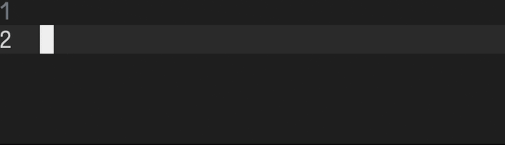
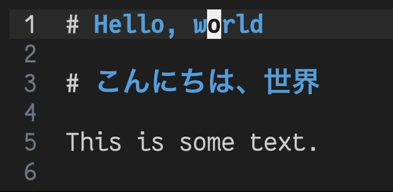
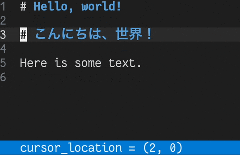
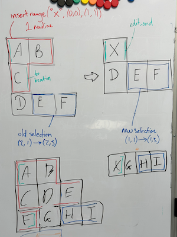
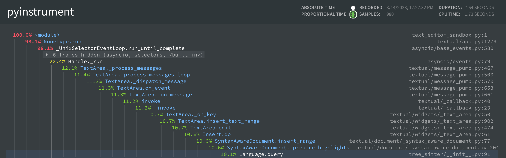
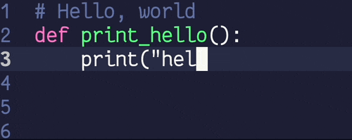
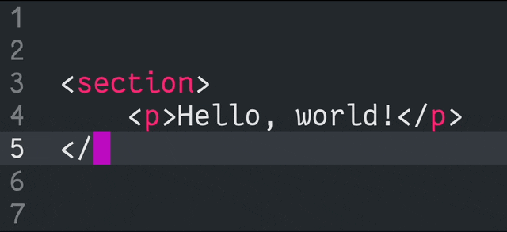

# Things I learned building a text editor for the terminal

`TextArea` is the latest widget to be added to Textual's [growing collection](https://textual.textualize.io/widget_gallery/).
It provides a multi-line space to edit text, and features optional syntax highlighting for a selection of languages.



Adding a `TextArea` to your Textual app is as simple as adding this to your `compose` method:

```python
yield TextArea()
```

Enabling syntax highlighting for a language is as simple as:

```python
yield TextArea(language="python")
```

Working on the `TextArea` widget for Textual taught me a lot about Python and my general
approach to software engineering. It gave me an appreciation for the subtle functionality behind
the editors we use on a daily basis — features we may not even notice, despite
some engineer spending hours perfecting it to provide a small boost to our development experience.

This post is a tour of some of these learnings.

<!-- more -->

## Vertical cursor movement is more than just `cursor_row++`

When you move the cursor vertically, you can't simply keep the same column index and clamp it within the line.
Editors should maintain the visual column offset where possible,
meaning they must account for double-width emoji (sigh 😔) and East-Asian characters.

{ loading=lazy }

Notice that although the cursor is on column 11 while on line 1, it lands on column 6 when it
arrives at line 3.
This is because the 6th character of line 3 _visually_ aligns with the 11th character of line 1.


## Edits from other sources may move my cursor

There are two ways to interact with the `TextArea`:

1. You can type into it.
2. You can make API calls to edit the content in it.

In the example below, `Hello, world!\n` is repeatedly inserted at the start of the document via the
API.
Notice that this updates the location of my cursor, ensuring that I don't lose my place.

{ loading=lazy }

This subtle feature should aid those implementing collaborative and multi-cursor editing.

This turned out to be one of the more complex features of the whole project, and went through several iterations before I was happy with the result.

Thankfully it resulted in some wonderful Tetris-esque whiteboards along the way!

<figure markdown>
  { loading=lazy }
  <figcaption>A TetrisArea white-boarding session.</figcaption>
</figure>

Sometimes stepping away from the screen and scribbling on a whiteboard with your colleagues (thanks [Dave](https://fosstodon.org/@davep)!) is what's needed to finally crack a tough problem.

Many thanks to [David Brochart](https://mastodon.top/@davidbrochart) for sending me down this rabbit hole!

## Spending a few minutes running a profiler can be really beneficial

While building the `TextArea` widget I avoided heavy optimisation work that may have affected
readability or maintainability.

However, I did run a profiler in an attempt to detect flawed assumptions or mistakes which were
affecting the performance of my code.

I spent around 30 minutes profiling `TextArea`
using [pyinstrument](https://pyinstrument.readthedocs.io/en/latest/home.html), and the result was a
**~97%** reduction in the time taken to handle a key press.
What an amazing return on investment for such a minimal time commitment!


<figure markdown>
  { loading=lazy }
  <figcaption>"pyinstrument -r html" produces this beautiful output.</figcaption>
</figure>

pyinstrument unveiled two issues that were massively impacting performance.

### 1. Reparsing highlighting queries on each key press

I was constructing a tree-sitter `Query` object on each key press, incorrectly assuming it was a
low-overhead call.
This query was completely static, so I moved it into the constructor ensuring the object was created
only once.
This reduced key processing time by around 94% - a substantial and very much noticeable improvement.

This seems obvious in hindsight, but the code in question was written earlier in the project and had
been relegated in my mind to "code that works correctly and will receive less attention from here on
out".
pyinstrument quickly brought this code back to my attention and highlighted it as a glaring
performance bug.

### 2. NamedTuples are slower than I expected

In Python, `NamedTuple`s are slow to create relative to `tuple`s, and this cost was adding up inside
an extremely hot loop which was instantiating a large number of them.
pyinstrument revealed that a large portion of the time during syntax highlighting was spent inside `NamedTuple.__new__`.

Here's a quick benchmark which constructs 10,000 `NamedTuple`s:

```toml
❯ hyperfine -w 2 'python sandbox/darren/make_namedtuples.py'
Benchmark 1: python sandbox/darren/make_namedtuples.py
  Time (mean ± σ):      15.9 ms ±   0.5 ms    [User: 12.8 ms, System: 2.5 ms]
  Range (min … max):    15.2 ms …  18.4 ms    165 runs
```

Here's the same benchmark using `tuple` instead:

```toml
❯ hyperfine -w 2 'python sandbox/darren/make_tuples.py'
Benchmark 1: python sandbox/darren/make_tuples.py
  Time (mean ± σ):       9.3 ms ±   0.5 ms    [User: 6.8 ms, System: 2.0 ms]
  Range (min … max):     8.7 ms …  12.3 ms    256 runs
```

Switching to `tuple` resulted in another noticeable increase in responsiveness.
Key-press handling time dropped by almost 50%!
Unfortunately, this change _does_ impact readability.
However, the scope in which these tuples were used was very small, and so I felt it was a worthy trade-off.


## Syntax highlighting is very different from what I expected

In order to support syntax highlighting, we make use of
the [tree-sitter](https://tree-sitter.github.io/tree-sitter/) library, which maintains a syntax tree
representing the structure of our document.

To perform highlighting, we follow these steps:

1. The user edits the document.
2. We inform tree-sitter of the location of this edit.
3. tree-sitter intelligently parses only the subset of the document impacted by the change, updating the tree.
4. We run a query against the tree to retrieve ranges of text we wish to highlight.
5. These ranges are mapped to styles (defined by the chosen "theme").
6. These styles to the appropriate text ranges when rendering the widget.

<figure markdown>
  { loading=lazy }
  <figcaption>Cycling through a few of the builtin themes.</figcaption>
</figure>

Another benefit that I didn't consider before working on this project is that tree-sitter
parsers can also be used to highlight syntax errors in a document.
This can be useful in some situations - for example, highlighting mismatched HTML closing tags:

<figure markdown>
  { loading=lazy }
  <figcaption>Highlighting mismatched closing HTML tags in red.</figcaption>
</figure>

Before building this widget, I was oblivious as to how we might approach syntax highlighting.
Without tree-sitter's incremental parsing approach, I'm not sure reasonable performance would have
been feasible.

## Edits are replacements

All single-cursor edits can be distilled into a single behaviour: `replace_range`.
This replaces a range of characters with some text.
We can use this one method to easily implement deletion, insertion, and replacement of text.

- Inserting text is replacing a zero-width range with the text to insert.
- Pressing backspace (delete left) is just replacing the character behind the cursor with an empty
  string.
- Selecting text and pressing delete is just replacing the selected text with an empty string.
- Selecting text and pasting is replacing the selected text with some other text.

This greatly simplified my initial approach, which involved unique implementations for inserting and
deleting.


## The line between "text area" and "VSCode in the terminal"

A project like this has no clear finish line.
There are always new features, optimisations, and refactors waiting to be made.

So where do we draw the line?

We want to provide a widget which can act as both a basic multiline text area that
anyone can drop into their app, yet powerful and extensible enough to act as the foundation
for a Textual-powered text editor.

Yet, the more features we add, the more opinionated the widget becomes, and the less that users
will feel like they can build it into their _own_ thing.
Finding the sweet spot between feature-rich and flexible is no easy task.

I don't think the answer is clear, and I don't believe it's possible to please everyone.

Regardless, I'm happy with where we've landed, and I'm really excited to see what people build using `TextArea` in the future!
