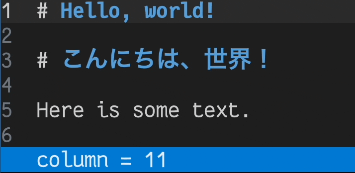

# Learnings from building Textual's TextArea widget

Working on the `TextArea` widget for Textual taught me that there are many subtle features in my text
editor that I'd been taking for granted.

<!-- more -->

### Vertical cursor movement

When you move the cursor vertically, you can't simply keep the same column index.
Editors should maintain the last visual horizontal offset the user navigated to.

In the clip above, notice how the column offset of the cursor changes as the cursor moves vertically between rows.
