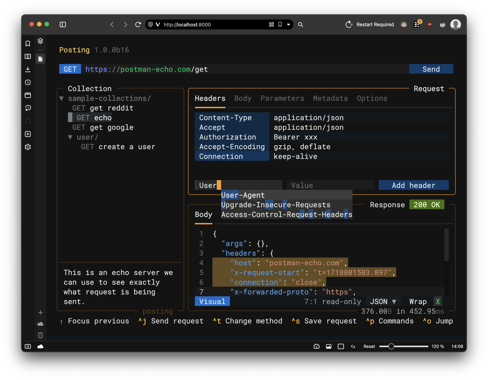
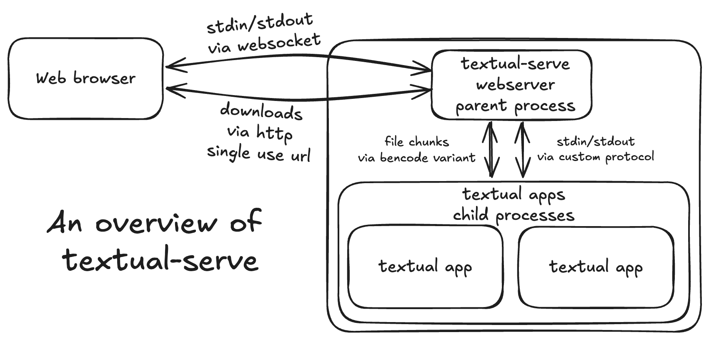

In this post we'll look at some new functionality available in Textual apps accessed via a browser and how it helps provide a more equal experience across platforms.

<!-- more -->

## What is `textual-serve`?

[`textual-serve`](https://github.com/Textualize/textual-serve) is an open source project which allows you to serve and access your Textual app via a browser. The Textual app runs on a machine/server under your control, and communicates with the browser via a protocol which runs over websocket. End-users interacting with the app via their browser do not have access to the machine the application is running on via their browser, only the running Textual app.

For example, you could install [`harlequin`](https://github.com/tconbeer/harlequin) (a terminal-based SQL IDE)  on a machine on your network, run it using `textual-serve`, and then share the URL with others. Anyone with the URL would then be able to use `harlequin` to query databases accessible from that server. Or, you could deploy [`posting`](https://github.com/darrenburns/posting) (a terminal-based API client) on a server, and provide your colleagues with the URL, allowing them to quickly send HTTP requests *from that server*, right from within their browser.

<figure markdown>

  <figcaption>Accessing an instance of Posting via a web browser.</figcaption>
</figure>

## Providing an equal experience

While you're interacting with the Textual app using your web browser, it's not *running* in your browser. It's running on the machine you've installed it on, similar to typical server driven web app. This creates some interesting challenges for us if we want to provide an equal experience across browser and terminal.

A Textual app running in the browser is inherently more accessible to non-technical users, and we don't want to limit access to important functionality for those users. We also don't want Textual app developers to have to repeatedly check "is the the end-user using a browser or a terminal?".

To solve this, we've created APIs which allow developers to add web links to their apps and deliver files to end-users in a platform agnostic way. The goal of these APIs is to allow developers to write applications knowing that they'll provide a sensible user experience in both terminals and web browsers without any extra effort.

## Opening web links

The ability to click on and open links is a pretty fundamental expectation when interacting with an app running in your browser.

Python offers a [`webbrowser`](https://docs.python.org/3/library/webbrowser.html) module which allows you to open a URL in a web browser. When a Textual app is running in a terminal, a simple call to this module does exactly what we'd expect.

If the app is being used via a browser however, the `webbrowser` module would attempt to open the browser on the machine the app is being served from. This is clearly not very useful to the end-user!

To solve this, we've added a new method to Textual: [`App.open_url`](https://textual.textualize.io/api/app/#textual.app.App.open_url). When running in the terminal, this will use `webbrowser` to open the URL as you would expect. 

When the Textual app is being served and used via the browser however, the running app will inform `textual-serve`, which will in turn tell the browser via websocket that the end-user is requesting to open a link, which will then be opened in their browser - just like a normal web link.

The developer doesn't need to think about *where* their application might be running. By using `open_url`, Textual will ensure that end-users get the experience they expect.

## Saving files to disk

When running a Textual app in the terminal, getting a file into the hands of the end user is relatively simple - you could just write it to disk and notify them of the location, or perhaps open their `$EDITOR` with the content loaded into it. Given they're using a terminal, we can also make an assumption that the end-user is at least some technical knowledge.

Run that same app in the browser however, and we have a problem. If you simply write the file to disk, the end-user would need to be able to access the machine the app is running on and navigate the file system in order to retrieve it. This may not be possible: they may not be permitted to access the machine, or they simply may not know how!

The new [`App.deliver_text`][textual.app.App.deliver_text] and [`App.deliver_binary`][textual.app.App.deliver_binary] methods are designed to let developers get files into the hands of end users, regardless of whether the app is being accessed via the browser or a terminal.

When accessing a Textual app using a terminal, these methods will write a file to disk, and notify the `App` when the write is complete.

In the browser, however, a download will be initiated and the file will be streamed via an ephemeral (one-time) download URL from the server that the Textual app is running on to the end-user's browser. If the app developer wishes, they can specify a custom file name, MIME type, and even whether the browser should attempt to open the file in a new tab or be downloaded.

## How it works

Input in Textual apps is handled, at the lowest level, by "driver" classes. We have different drivers for Linux and Windows, and also one for handling apps being served via web. 

When running in a terminal, the Windows/Linux drivers will read `stdin`, and parse incoming ANSI escape sequences sent by the terminal emulator as a result of mouse movement or keyboard interaction. The driver translates these escape sequences into Textual "Events", which are sent on to your application's message queue for asynchronous handling.

For apps being served over the web, things are again a bit more complex. Interaction between the application and the end-user happens inside the browser - with a terminal rendered using [`xterm.js`](https://xtermjs.org/) - the same front-end terminal engine used in VS Code. `xterm.js` fills the roll of a terminal emulator here, translating user interactions into ANSI escape codes on `stdin`.

These escape codes are sent through websocket to `textual-serve` and then piped to the `stdin` stream of the Textual app which is running as a subprocess. Inside the Textual app, these can be processed and converted into events as normal by Textual's web driver.

A Textual app also writes to the `stdout` stream, which is then read by your emulator and translated into visual output. When running on the web, this stdout is also sent over websocket to the end-user's browser, and `xterm.js` takes care of rendering.

Although most of the data flowing back and forth from browser to Textual app is going to be ANSI escape sequences, we can in reality send anything we wish.

To support file delivery we updated our protocol to allow applications to signal that a file is "ready" for delivery when one of the new "deliver file" APIs is called. An ephemeral, single-use, download link is then generated and sent to the browser via websocket. The front-end of `textual-serve` opens this URL and the file is streamed to the browser.

This streaming process involves continuous delivery of encoded chunks of the file (using a variation of [Bencode](https://en.wikipedia.org/wiki/Bencode) - the encoding used by [BitTorrent](https://en.wikipedia.org/wiki/BitTorrent)) from the Textual app process to `textual-serve`, and then through to the end-user via the download URL.

## The result

These new APIs close an important feature gap and give developers the option to build apps that can accessed via terminals or browsers without worrying that those on the web might miss out on important functionality!

## Found this interesting?

Join our [Discord server](https://discord.gg/Enf6Z3qhVr) to chat to myself and other Textual developers.
