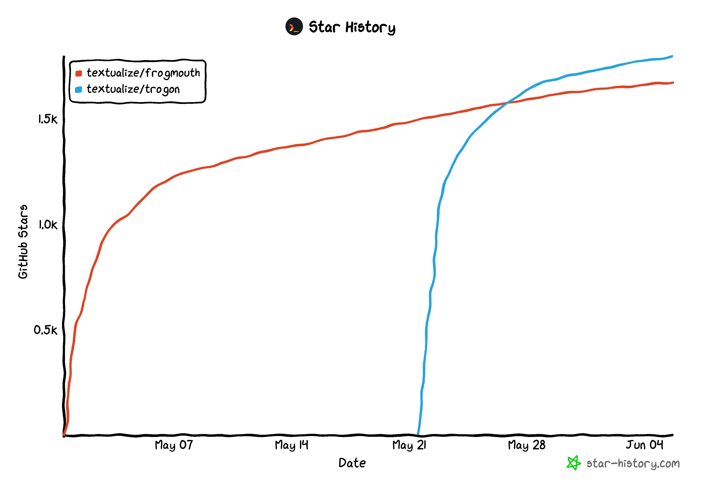

# To TUI or not to TUI

Tech moves pretty fast.
If you don’t stop and look around once in a while, you could miss it.
And yet some technology feels like it has been around forever.

Terminals are one of those forever-technologies.

<!-- more -->

My interest is in Text User Interfaces:  interactive apps that run within a terminal.
I spend lot of time thinking about where TUIs might fit within the tech ecosystem, and how much more they could be doing for developers.
Hardly surprising, since that is what we do at [Textualize](https://textual.textualize.io/).

Recently I had the opportunity to test how new TUI projects would be received.
You can consider these to be "testing the water", and hopefully representative of TUI apps in general.

## The projects

In April we took a break from building [Textual](https://github.com/Textualize/textual), to building apps *with* Textual.
We had three ideas to work on, and three devs to do the work.
One idea we parked for later.
The other two were so promising we devoted more time to them.
Both projects took around three developer-weeks to build, which also included work on Textual itself and standard duties for responding to issues / community requests.
We released them in May.

The first project was [Frogmouth](https://github.com/Textualize/frogmouth), a Markdown browser.
I think this TUI does better than the equivalent web experience in many ways.
The only notable missing feature is images, and that will happen before too long.

Here's a screenshot:

--8<-- "docs/blog/images/frogmouth.svg"

!!! info

    Quick aside about these "screenshots", because its a common ask.
    They aren't true screenshots, but rather SVGs exported by Textual.

We posted Frogmouth on Hacker News and Reddit on a Sunday morning (US time).
A day later, it had 1,000 stars and lots of positive feedback.

The second project was [Trogon](https://github.com/Textualize/trogon), a library this time.
Trogon automatically creates a TUI for command line apps.
Same deal: we released it on a Sunday morning, and it reached 1K stars even quicker than Frogmouth.

--8<-- "docs/blog/images/trogon.svg"

Both of these projects are very young, but off to a great start.
I'm looking forward to seeing how far we can taken them.

## Wrapping up

With previous generations of software, TUIs have required a high degree of motivation to build.
That has changed with the work that we (and others) have been doing.
A TUI can be a powerful and maintainable piece of software which works as a standalone project, or as a value-add to an existing project.

As a forever-technology, a TUI is a safe bet.

## Discord

Want to discuss this post with myself or other Textualize devs?
Join our [Discord server](https://discord.gg/Enf6Z3qhVr)...
