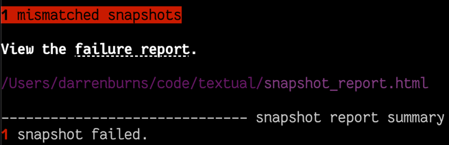
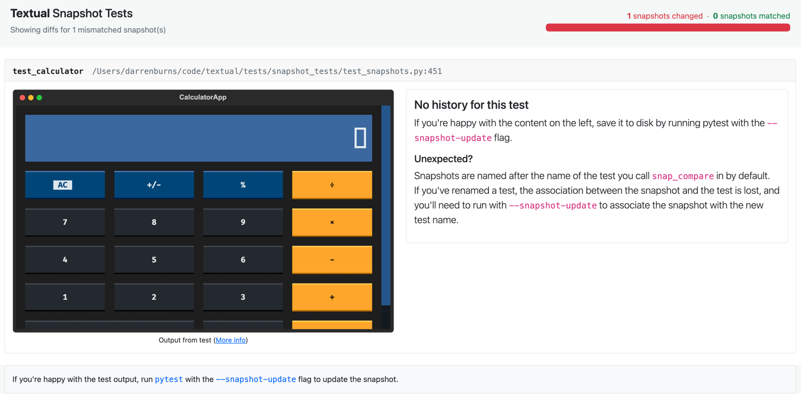
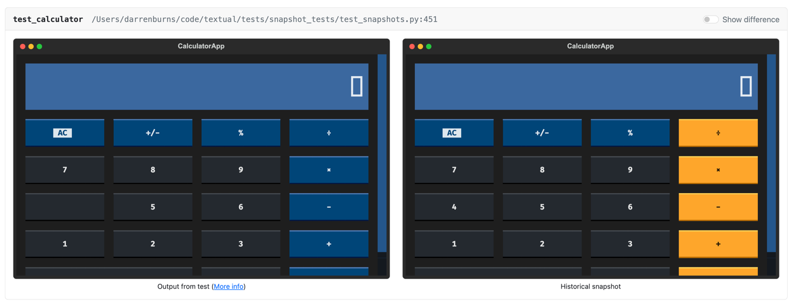
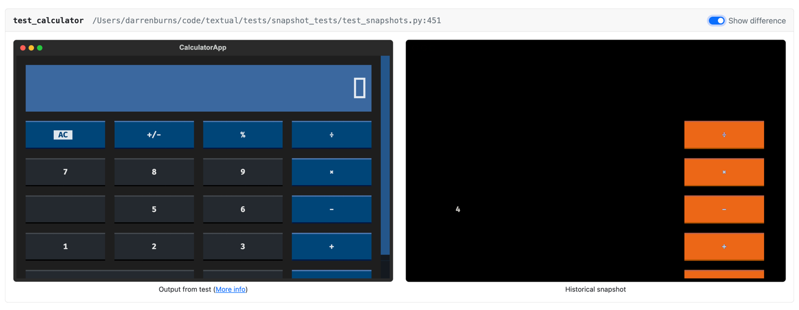

# Testing

Code testing is an important part of software development.
This chapter will cover how to write tests for your Textual apps.

## What is testing?

It is common to write tests alongside your app.
A *test* is simply a function that confirms your app is working correctly.

!!! tip "Learn more about testing"

    We recommend [Python Testing with pytest](https://pythontest.com/pytest-book/) for a comprehensive guide to writing tests.

## Do you need to write tests?

The short answer is "no", you don't *need* to write tests.

In practice however, it is almost always a good idea to write tests.
Writing code that is completely bug free is virtually impossible, even for experienced developers.
If you want to have confidence that your application will run as you intended it to, then you should write tests.
Your test code will help you find bugs early, and alert you if you accidentally break something in the future.

## Testing frameworks for Textual

Textual is an async framework powered by Python's [asyncio](https://docs.python.org/3/library/asyncio.html) library.
While Textual doesn't require a particular test framework, it must provide support for asyncio testing.

You can use any test framework you are familiar with, but we will be using [pytest](https://docs.pytest.org/)
along with the [pytest-asyncio](https://pytest-asyncio.readthedocs.io/) plugin in this chapter.

By default, the `pytest-asyncio` plugin requires each async test to be decorated with `@pytest.mark.asyncio`.
You can avoid having to add this marker to every async test
by setting `asyncio_mode = auto` in your pytest configuration
or by running pytest with the `--asyncio-mode=auto` option.

## Testing apps

You can often test Textual code in the same way as any other app, and use similar techniques.
But when testing user interface interactions, you may need to use Textual's dedicated test features.

Let's write a simple Textual app so we can demonstrate how to test it.
The following app shows three buttons labelled "red", "green", and "blue".
Clicking one of those buttons or pressing a corresponding ++r++, ++g++, and ++b++ key will change the background color.

=== "rgb.py"

    ```python
    --8<-- "docs/examples/guide/testing/rgb.py"
    ```

=== "Output"

    ```{.textual path="docs/examples/guide/testing/rgb.py"}
    ```

Although it is straightforward to test an app like this manually, it is not practical to click every button and hit every key in your app after changing a single line of code.
Tests allow us to automate such testing so we can quickly simulate user interactions and check the result.

To test our simple app we will use the [`run_test()`][textual.app.App.run_test] method on the `App` class.
This replaces the usual call to [`run()`][textual.app.App.run] and will run the app in *headless* mode, which prevents Textual from updating the terminal but otherwise behaves as normal.

The `run_test()` method is an *async context manager* which returns a [`Pilot`][textual.pilot.Pilot] object.
You can use this object to interact with the app as if you were operating it with a keyboard and mouse.

Let's look at the tests for the example above:

```python title="test_rgb.py"
--8<-- "docs/examples/guide/testing/test_rgb.py"
```

1. The `run_test()` method requires that it run in a coroutine, so tests must use the `async` keyword.
2. This runs the app and returns a Pilot instance we can use to interact with it.
3. Simulates pressing the ++r++ key.
4. This checks that pressing the ++r++ key has resulted in the background color changing.
5. Simulates clicking on the widget with an `id` of `red` (the button labelled "Red").

There are two tests defined in `test_rgb.py`.
The first to test keys and the second to test button clicks.
Both tests first construct an instance of the app and then call `run_test()` to get a Pilot object.
The `test_keys` function simulates key presses with [`Pilot.press`][textual.pilot.Pilot.press], and `test_buttons` simulates button clicks with [`Pilot.click`][textual.pilot.Pilot.click].

After simulating a user interaction, Textual tests will typically check the state has been updated with an `assert` statement.
The `pytest` module will record any failures of these assert statements as a test fail.

If you run the tests with `pytest test_rgb.py` you should get 2 passes, which will confirm that the user will be able to click buttons or press the keys to change the background color.

If you later update this app, and accidentally break this functionality, one or more of your tests will fail.
Knowing which test has failed will help you quickly track down where your code was broken.

## Simulating key presses

We've seen how the [`press`][textual.pilot.Pilot] method simulates keys.
You can also supply multiple keys to simulate the user typing into the app.
Here's an example of simulating the user typing the word "hello".

```python
await pilot.press("h", "e", "l", "l", "o")
```

Each string creates a single keypress.
You can also use the name for non-printable keys (such as "enter") and the "ctrl+" modifier.
These are the same identifiers as used for key events, which you can experiment with by running `textual keys`.

## Simulating clicks

You can simulate mouse clicks in a similar way with [`Pilot.click`][textual.pilot.Pilot.click].
If you supply a CSS selector Textual will simulate clicking on the matching widget.

!!! note

    If there is another widget in front of the widget you want to click, you may end up clicking the topmost widget rather than the widget indicated in the selector.
    This is generally what you want, because a real user would experience the same thing.

### Clicking the screen

If you don't supply a CSS selector, then the click will be relative to the screen.
For example, the following simulates a click at (0, 0):

```python
await pilot.click()
```

### Click offsets

If you supply an `offset` value, it will be added to the coordinates of the simulated click.
For example the following line would simulate a click at the coordinates (10, 5).


```python
await pilot.click(offset=(10, 5))
```

If you combine this with a selector, then the offset will be relative to the widget.
Here's how you would click the line *above* a button.

```python
await pilot.click(Button, offset=(0, -1))
```

### Double & triple clicks

You can simulate double and triple clicks by setting the `times` parameter.

```python
await pilot.click(Button, times=2)  # Double click
await pilot.click(Button, times=3)  # Triple click
```

### Modifier keys

You can simulate clicks in combination with modifier keys, by setting the `shift`, `meta`, or `control` parameters.
Here's how you could simulate ctrl-clicking a widget with an ID of "slider":

```python
await pilot.click("#slider", control=True)
```

## Changing the screen size

The default size of a simulated app is (80, 24).
You may want to test what happens when the app has a different size.
To do this, set the `size` parameter of [`run_test`][textual.app.App.run_test] to a different size.
For example, here is how you would simulate a terminal resized to 100 columns and 50 lines:

```python
async with app.run_test(size=(100, 50)) as pilot:
    ...
```

## Pausing the pilot

Some actions in a Textual app won't change the state immediately.
For instance, messages may take a moment to bubble from the widget that sent them.
If you were to post a message and immediately `assert` you may find that it fails because the message hasn't yet been processed.

You can generally solve this by calling [`pause()`][textual.pilot.Pilot.pause] which will wait for all pending messages to be processed.
You can also supply a `delay` parameter, which will insert a delay prior to waiting for pending messages.


## Textual's tests

Textual itself has a large battery of tests.
If you are interested in how we write tests, see the [tests/](https://github.com/Textualize/textual/tree/main/tests) directory in the Textual repository.

## Snapshot testing

Snapshot testing is the process of recording the output of a test, and comparing it against the output from previous runs.

Textual uses snapshot testing internally to ensure that the builtin widgets look and function correctly in every release.
We've made the pytest plugin we built available for public use.

The [official Textual pytest plugin](https://github.com/Textualize/pytest-textual-snapshot) can help you catch otherwise difficult to detect visual changes in your app.

It works by generating an SVG _screenshot_ (such as the images in these docs) from your app.
If the screenshot changes in any test run, you will have the opportunity to visually compare the new output against previous runs.


### Installing the plugin

You can install `pytest-textual-snapshot` using your favorite package manager (`pip`, `poetry`, etc.).

```
pip install pytest-textual-snapshot
```

### Creating a snapshot test

With the package installed, you now have access to the `snap_compare` pytest fixture.

Let's look at an example of how we'd create a snapshot test for the [calculator app](https://github.com/Textualize/textual/blob/main/examples/calculator.py) below.

```{.textual path="examples/calculator.py" columns=100 lines=41 press="3,.,1,4,5,9,2,wait:400"}
```

First, we need to create a new test and specify the path to the Python file containing the app.
This path should be relative to the location of the test.

```python
def test_calculator(snap_compare):
    assert snap_compare("path/to/calculator.py")
```

Let's run the test as normal using `pytest`.

```
pytest
```

When this test runs for the first time, an SVG screenshot of the calculator app is generated, and the test will fail.
Snapshot tests always fail on the first run, since there's no previous version to compare the snapshot to.



If you open the snapshot report in your browser, you'll see something like this:



!!! tip

    You can usually open the link directly from the terminal, but some terminal emulators may
    require you to hold ++ctrl++ or ++command++ while clicking for links to work.

The report explains that there's "No history for this test".
It's our job to validate that the initial snapshot looks correct before proceeding.
Our calculator is rendering as we expect, so we'll save this snapshot:

```
pytest --snapshot-update
```

!!! warning

    Only ever run pytest with `--snapshot-update` if you're happy with how the output looks
    on the left hand side of the snapshot report. When using `--snapshot-update`, you're saying "I'm happy with all of the
    screenshots in the snapshot test report, and they will now represent the ground truth which all future runs will be compared
    against". As such, you should only run `pytest --snapshot-update` _after_ running `pytest` and confirming the output looks good.

Now that our snapshot is saved, if we run `pytest` (with no arguments) again, the test will pass.
This is because the screenshot taken during this test run matches the one we saved earlier.

### Catching a bug

The real power of snapshot testing comes from its ability to catch visual regressions which could otherwise easily be missed.

Imagine a new developer joins your team, and tries to make a few changes to the calculator.
While making this change they accidentally break some styling which removes the orange coloring from the buttons on the right of the app.
When they run `pytest`, they're presented with a report which reveals the damage:



On the right, we can see our "historical" snapshot - this is the one we saved earlier.
On the left is how our app is currently rendering - clearly not how we intended!

We can click the "Show difference" toggle at the top right of the diff to overlay the two versions:



This reveals another problem, which could easily be missed in a quick visual inspection -
our new developer has also deleted the number 4!

!!! tip

    Snapshot tests work well in CI on all supported operating systems, and the snapshot
    report is just an HTML file which can be exported as a build artifact.


### Pressing keys

You can simulate pressing keys before the snapshot is captured using the `press` parameter.

```python
def test_calculator_pressing_numbers(snap_compare):
    assert snap_compare("path/to/calculator.py", press=["1", "2", "3"])
```

### Changing the terminal size

To capture the snapshot with a different terminal size, pass a tuple `(width, height)` as the `terminal_size` parameter.

```python
def test_calculator(snap_compare):
    assert snap_compare("path/to/calculator.py", terminal_size=(50, 100))
```

### Running setup code

You can also run arbitrary code before the snapshot is captured using the `run_before` parameter.

In this example, we use `run_before` to hover the mouse cursor over the widget with ID `number-5`
before taking the snapshot.

```python
def test_calculator_hover_number(snap_compare):
    async def run_before(pilot) -> None:
        await pilot.hover("#number-5")

    assert snap_compare("path/to/calculator.py", run_before=run_before)
```

For more information, visit the [`pytest-textual-snapshot` repo on GitHub](https://github.com/Textualize/pytest-textual-snapshot).
