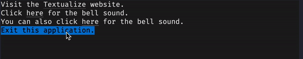

# Link-color-hover

The `link-color-hover` style sets the color of the link text when the mouse cursor is over the link.

!!! note

    `link-color-hover` only applies to Textual action links as described in the [actions guide](../../guide/actions.md#links) and not to regular hyperlinks.

## Syntax

--8<-- "docs/snippets/syntax_block_start.md"
link-color-hover: <a href="../../../css_types/color">&lt;color&gt;</a> [<a href="../../../css_types/percentage">&lt;percentage&gt;</a>];
--8<-- "docs/snippets/syntax_block_end.md"

`link-color-hover` accepts a [`<color>`](../../css_types/color.md) (with an optional opacity level defined by a [`<percentage>`](../../css_types/percentage.md)) that is used to define the color of text enclosed in Textual action links when the mouse pointer is over it.

### Defaults

If not provided, a Textual action link will have `link-color-hover` set to `white`.

## Example

The example below shows some links that have their color changed when the mouse moves over it.
It also shows that `link-color-hover` does not affect hyperlinks.

=== "Output"

    

    !!! note

        The background color also changes when the mouse moves over the links because that is the default behavior.
        That can be customised by setting [`link-background-hover`](./link_background_hover.md) but we haven't done so in this example.

    !!! note

        The GIF has reduced quality to make it easier to load in the documentation.
        Try running the example yourself with `textual run docs/examples/styles/link_color_hover.py`.

=== "link_color_hover.py"

    ```py hl_lines="10-11 14-15 18-19 22-23"
    --8<-- "docs/examples/styles/link_color_hover.py"
    ```

    1. This label has a hyperlink so it won't be affected by the `link-color-hover` rule.
    2. This label has an "action link" that can be styled with `link-color-hover`.
    3. This label has an "action link" that can be styled with `link-color-hover`.
    4. This label has an "action link" that can be styled with `link-color-hover`.

=== "link_color_hover.tcss"

    ```css hl_lines="2 6 10"
    --8<-- "docs/examples/styles/link_color_hover.tcss"
    ```

    1. This will only affect one of the labels because action links are the only links that this rule affects.

## CSS

```css
link-color-hover: red 70%;
link-color-hover: black;
```

## Python

```py
widget.styles.link_color_hover = "red 70%"
widget.styles.link_color_hover = "black"

# You can also use a `Color` object directly:
widget.styles.link_color_hover = Color(100, 30, 173)
```

## See also

 - [`link-color`](./link_color.md) to set the color of link text.
 - [`link-background-hover`](./link_background_hover.md) to set the background color of link text when the mouse pointer is over it.
 - [`link-style-hover`](./link_style_hover.md) to set the style of link text when the mouse pointer is over it.
