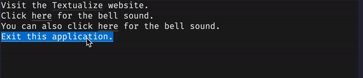

# Link-hover-style

The `link-hover-style` style sets the text style for the link text when the mouse cursor is over the link.

!!! note

    `link-hover-style` only applies to Textual action links as described in the [actions guide](../../guide/actions.md#links) and not to regular hyperlinks.

## Syntax

--8<-- "docs/snippets/syntax_block_start.md"
link-hover-style: <a href="../../css_types/text_style">&lt;text-style&gt;</a>;
--8<-- "docs/snippets/syntax_block_end.md"

`link-hover-style` applies its [`<text-style>`](../../../css_types/text_style) to the text of Textual action links when the mouse pointer is over them.

### Defaults

If not provided, a Textual action link will have `link-hover-style` set to `bold`.

## Example

The example below shows some links that have their colour changed when the mouse moves over it.
It also shows that `link-hover-style` does not affect hyperlinks.

=== "Output"

    

    !!! note

        The background color also changes when the mouse moves over the links because that is the default behavior.
        That can be customised by setting [`link-hover-background`](./link_hover_background.md) but we haven't done so in this example.

    !!! note

        The GIF has reduced quality to make it easier to load in the documentation.
        Try running the example yourself with `textual run docs/examples/styles/link_hover_style.py`.

=== "link_hover_style.py"

    ```py hl_lines="8-9 12-13 16-17 20-21"
    --8<-- "docs/examples/styles/link_hover_style.py"
    ```

    1. This label has an hyperlink so it won't be affected by the `link-hover-style` rule.
    2. This label has an "action link" that can be styled with `link-hover-style`.
    3. This label has an "action link" that can be styled with `link-hover-style`.
    4. This label has an "action link" that can be styled with `link-hover-style`.

=== "link_hover_style.css"

    ```sass hl_lines="2 6 10"
    --8<-- "docs/examples/styles/link_hover_style.css"
    ```

    1. This will only affect one of the labels because action links are the only links that this rule affects.
    2. The default behavior for links on hover is to change to a different text style, so we don't need to change anything if all we want is to add emphasis to the link under the mouse.

## CSS

```sass
link-hover-style: bold;
link-hover-style: bold italic reverse;
```

## Python

```py
widget.styles.link_hover_style = "bold"
widget.styles.link_hover_style = "bold italic reverse"
```

## See also

 - [`link-hover-background](./link_hover_background.md) to set the background color of link text when the mouse pointer is over it.
 - [`link-hover-color](./link_hover_color.md) to set the color of link text when the mouse pointer is over it.
 - [`link-style`](./link_style.md) to set the style of link text.
 - [`text-style`](../text_style.md) to set the style of text in a widget.
