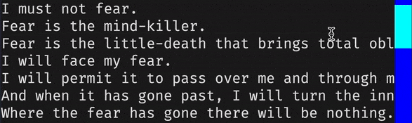

# Scrollbar-background

The `scrollbar-background` style sets the background color of the scrollbar.
## Syntax

--8<-- "docs/snippets/syntax_block_start.md"
<a href="./scrollbar_background">scrollbar-background</a>: <a href="../../../css_types/color">&lt;color&gt;</a> [<a href="../../../css_types/percentage">&lt;percentage&gt;</a>];
--8<-- "docs/snippets/syntax_block_end.md"

`scrollbar-background` accepts a [`<color>`](../../css_types/color.md) (with an optional opacity level defined by a [`<percentage>`](../../css_types/percentage.md)) that is used to define the background color of a scrollbar.

## Example

=== "Output"

    

    !!! note

        The GIF above has reduced quality to make it easier to load in the documentation.
        Try running the example yourself with `textual run docs/examples/styles/scrollbars2.py`.

=== "scrollbars2.py"

    ```py
    --8<-- "docs/examples/styles/scrollbars2.py"
    ```

=== "scrollbars2.tcss"

    ```css hl_lines="2"
    --8<-- "docs/examples/styles/scrollbars2.tcss"
    ```

## CSS

```css
scrollbar-background: blue;
```

## Python

```py
widget.styles.scrollbar_background = "blue"
```

## See also

 - [`scrollbar-background-active`](./scrollbar_color_active.md) to set the scrollbar background color when the scrollbar is being dragged.
 - [`scrollbar-background-hover`](./scrollbar_color_hover.md) to set the scrollbar background color when the mouse pointer is over it.
 - [`scrollbar-color`](./scrollbar_color.md) to set the color of scrollbars.
 - [`scrollbar-corner-color`](./scrollbar_corner_color.md) to set the color of the corner where horizontal and vertical scrollbars meet.
