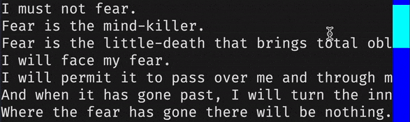

# Scrollbar-background-active

The `scrollbar-background-active` style sets the background color of the scrollbar when the thumb is being dragged.

## Syntax

--8<-- "docs/snippets/syntax_block_start.md"
<a href="./scrollbar_background_active">scrollbar-background-active</a>: <a href="../../css_types/color">&lt;color&gt;</a> [<a href="../../css_types/percentage">&lt;percentage&gt;</a>];
--8<-- "docs/snippets/syntax_block_end.md"

`scrollbar-background-active` accepts a [`<color>`](../../../css_types/color) (with an optional opacity level defined by a [`<percentage>`](../../../css_types/percentage)) that is used to define the background color of a scrollbar when its thumb is being dragged.

## Example

=== "Output"

    

    !!! note

        The GIF above has reduced quality to make it easier to load in the documentation.
        Try running the example yourself with `textual run docs/examples/styles/scrollbars2.py`.

=== "scrollbars2.py"

    ```py
    --8<-- "docs/examples/styles/scrollbars2.py"
    ```

=== "scrollbars2.css"

    ```sass hl_lines="3"
    --8<-- "docs/examples/styles/scrollbars2.css"
    ```

## CSS

```sass
scrollbar-backround-active: red;
```

## Python

```py
widget.styles.scrollbar_background_active = "red"
```

## See also

 - [`scrollbar-background`](./scrollbar_background.md) to set the background color of scrollbars.
 - [`scrollbar-bakcground-hover`](./scrollbar_color_hover.md) to set the scrollbar bakcground color when the mouse pointer is over it.
 - [`scrollbar-color-active`](./scrollbar_color_active.md) to set the scrollbar color when the scrollbar is being dragged.
